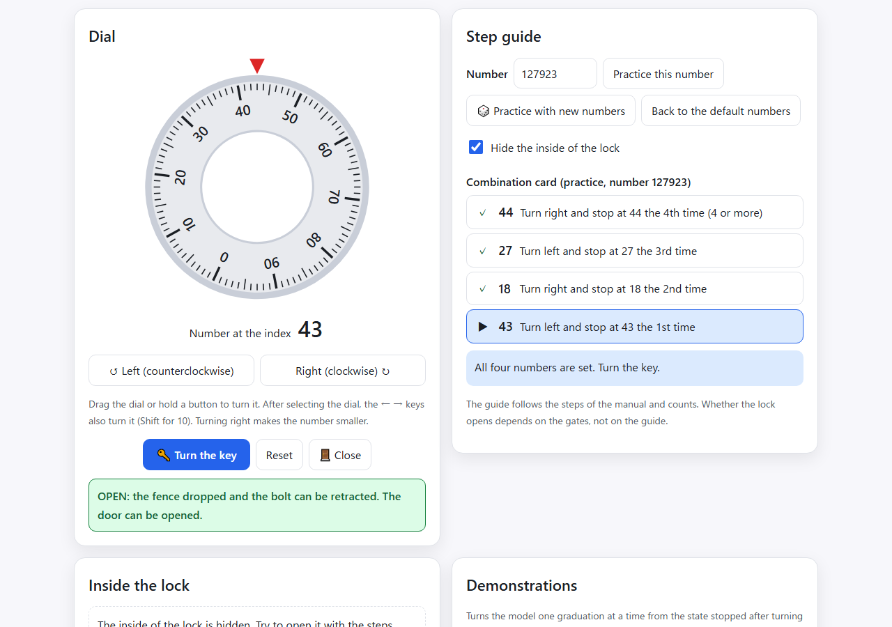
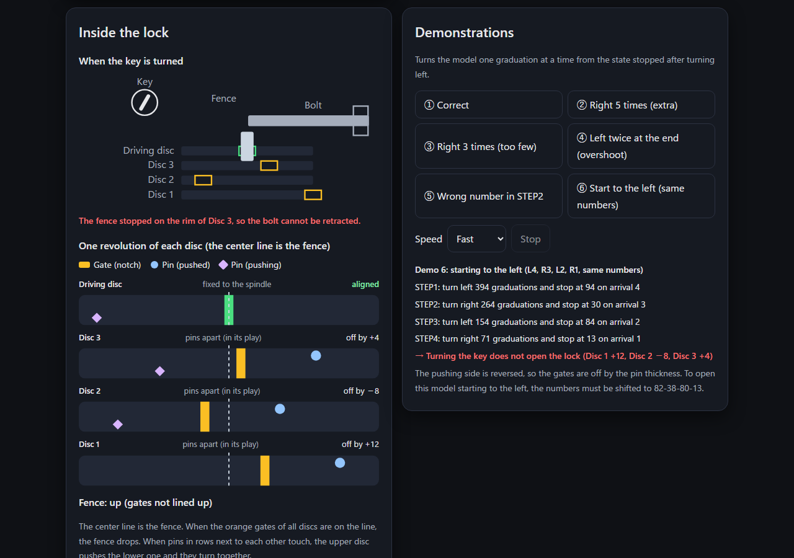
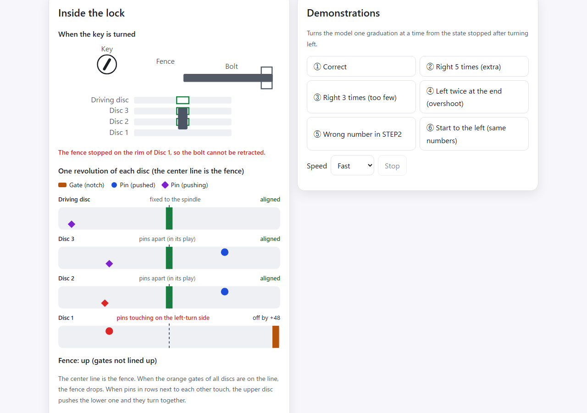
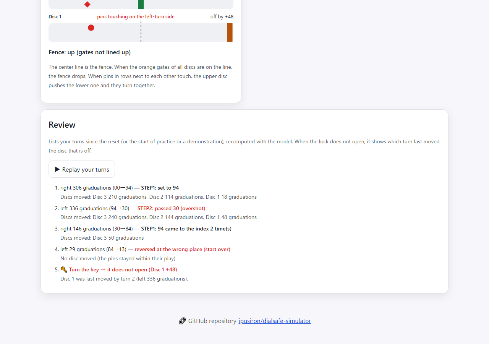

English · [日本語](README.md)

# DialSafe Simulator - Safe Dial Lock Simulator


[](https://ipusiron.github.io/dialsafe-simulator/)

**Day050 - 100 Security Tools with Generative AI**

DialSafe Simulator is a browser-based visualization tool for learning the legitimate way to open a dial safe and what moves inside it. It models the "4-disc fixed dial lock" common in Japanese home fire-resistant safes as a chain of play between pins (tsuku). When you turn the dial, you can watch the pin of the driving disc travel almost a full revolution before it picks up the next disc and moves its gate. Whether the lock opens depends only on the gate positions, so the model itself shows why "right 4, left 3, right 2, left 1" opens the lock and why overshooting does not.

The tool has two tabs.

1. Learn: explains the structure of the fixed dial lock, how it opens, how to operate it, and what the counts in the steps mean
2. Simulator: open the lock with a dial that turns the same way as a real one, with a step guide, a view inside the lock, demonstrations, a practice mode and a review of your turns

> This tool is for education (understanding legitimate operation) and does not cover attack or bypass techniques.

---

## 🌐 Demo

👉 **[https://ipusiron.github.io/dialsafe-simulator/](https://ipusiron.github.io/dialsafe-simulator/)**

Try it directly in your browser.

---

## 📸 Screenshots

>
>
>*The dial turned as on the combination card (94-30-84-13), then the key turned: OPEN*

>
>
>*100 graduations to the left in STEP2. The pin of the driving disc has met the pin of Disc 3, and Disc 3 starts turning with it (dark)*

>
>
>*Passing 30 in STEP2 makes the guide warn about the overshoot. Turning the key does not open the lock, because Disc 1 was picked up and moved*

>
>
>*Demonstration 3 (only 3 turns to the right first). It explains, in graduations, why stopping before Disc 1 is picked up leaves the lock closed (dark)*

>
>
>*"Why these counts?" on the Learn tab, showing from the model how many graduations it takes before each disc starts moving (97, 193, 289)*

>
>
>*Practice mode. Opened the combination card (12-88-28-68) and initial state given by a practice number with the steps alone, with the inside hidden*

>
>
>*Demonstration 6 (starting to the left). The pushing side is reversed, so with the same numbers the gates are off by the pin thickness and the lock stays closed (dark)*

>
>
>*The key turned after overshooting in STEP2. The fence passes three gates but stops on the rim of Disc 1, which is off*

>
>
>*The review of the same turns. It lists the discs moved and the guide's judgment for each turn, and shows that turn 2 (left 336 graduations) last moved Disc 1*

---

## 🔐 Target dial lock

Safe dial locks come in many types. This tool models and visualizes the "4-disc fixed dial lock (fixed conversion dial lock)" widely used in Japanese home safes.


The structure and procedure may differ by manufacturer and model. This tool is a simplified model for education.

- Target: 4-disc fixed dial lock (fixed conversion dial lock)
- Assumptions: scale 0–99, legitimate opening with 4 numbers, the "turn right first" procedure common in Japanese products
- Not covered: variable conversion types, special mechanisms of other standards or large commercial safes, electronic locks and so on

> Use for anything other than research and education (unauthorized access, property damage and so on) is prohibited.

---

## ✨ Features

### 📚 Learn tab

- What a fixed dial lock is, its structure (main components), how it opens (Figures 1–3), and how to operate it (the four steps and how to count)
- Right and left: right is clockwise. The scale increases clockwise, so turning right makes the number under the index smaller (with a photo of a real dial)
- Why these counts: shows from the model how many graduations it takes before each disc starts moving, and how many discs each step moves
- Why turn right 4 or more times when locking: explains that just closing the door leaves the gates lined up, so the key alone opens it
- How many combinations: the 100⁴ = 100 million in name, and how many combinations line the gates up exactly with the legitimate steps (from the model)

### 🎛️ Simulator

- A dial with a scale (0–99, increasing clockwise). Turning right (clockwise) makes the number smaller. The number at the index is shown large in a box that does not turn
- How to turn: drag the dial, use the "Right" and "Left" buttons (hold to keep turning), or select the dial and use the ← → keys (Shift for 10 graduations)
- Step guide: shows where you are in the four steps of the combination card, how many times the number has come to the index, and warns about overshooting, reversing at the wrong place, or starting to the left
- Turn the key: opens if the four gates are lined up with the fence. Otherwise it lists the discs that are off and by how many graduations
- Inside the lock: draws the gate and two kinds of pins (pushed and pushing) of each disc on horizontal strips, and colors the discs whose pins are touching and the gates that are lined up
- Close: closes the door after opening. Turning the dial right 4 or more times reports that the numbers are scrambled, and turning the key without scrambling shows that the lock opens anyway
- When the key is turned: draws the four gates in a window right under the fence. Turning the key lowers the fence; if it passes all four gates it drops and the bolt is retracted, otherwise it shows the disc where the fence stops
- Practice mode: practice with the combination card and initial state given by a practice number (1 to 999999). The same number always gives the same problem, so it can be shared in a class. The inside can be hidden (while hidden, the reason a lock does not open is not shown either)
- Review: recomputes your turns since the reset (or the start of practice or a demonstration) with the model, and lists the graduations, the discs moved and the guide's judgment for each turn. When the lock does not open, it shows which turn last moved the disc that is off. "Replay your turns" moves the dial through your turns again

### 🎬 Demonstrations

- Six demonstrations that turn the model one graduation at a time from the state stopped after turning left (in practice mode, with the practice numbers)
- ① correct, ② right 5 times (extra), ③ right 3 times (too few), ④ left twice at the end (overshoot), ⑤ wrong number in STEP2, ⑥ starting to the left (same numbers)
- The log shows how many graduations each step turned, the result of turning the key, and why the lock did not open. You can choose the speed (slow, normal, fast) and stop a demonstration

### 🌐 Interface

- Japanese and English (`?lang=ja`, `?lang=en`; the choice is saved), light and dark themes (also follows the OS setting)
- No horizontal overflow even on a 390px-wide smartphone. Buttons are at least 44px tall
- Tabs can also be moved with the arrow keys, Home and End. The step guide and results are announced to screen readers (aria-live)
- Works when index.html is opened directly as a file (built with plain scripts)

---

## 📖 Usage

1. Open the Simulator tab. The initial state is stopped after turning left (all three discs have their pins touching on the left-turn side)
2. Following the combination card, turn right and stop at 94 the 4th time (let 94 pass the index 3 times and stop exactly when it comes the 4th time)
3. Reverse, turn left and stop at 30 the 3rd time. Then turn right and stop at 84 the 2nd time, and turn left and stop at 13 the 1st time
4. Press "Turn the key". If the four gates are lined up, the lock opens. If not, the discs that are off are listed, so reset and try again
5. In "Inside the lock", watch the moment a pin meets another and the discs start turning together
6. In the demonstrations, see why the lock does not open when the counts change or a number is wrong
7. After opening, press "Close" and turn the key right away to see that it opens, then turn right 4 or more times to scramble the numbers and see that it no longer opens
8. With "Practice with new numbers" (or enter a number and "Practice this number"), open the combination card with the steps alone. With "Hide the inside of the lock", you cannot see inside, just like a real safe
9. If it does not open, check in the review which turn moved which disc

---

## 🔩 Fixed dial lock basics (4 discs, fixed conversion)

The following is an excerpt and summary from ["Hacker's School Lock Picking Textbook"](https://akademeia.info/?page_id=299), p. 451.

### Basic structure of the fixed dial lock in a fire-resistant safe

The main components and their features are as follows.

- Dial (knob): the operating part printed with the 0–99 scale. A larger diameter means a higher grade
- Base plate (with index): a base with a red index or a cut line
- Discs 1–3: each disc has 1 gate and 2 pins
- Driving disc: larger than the others, with 1 pin, connected directly to the dial by the spindle
- Spindle: the central shaft through the tube, connected only to the driving disc
- Tension spring: presses the discs together and keeps the pins in contact
- L dimension: the distance from the base plate to the driving disc; must be larger than the door thickness


Only the driving disc is connected directly to the dial through the spindle, so it is driven first. The other discs are pressed together by the tension spring, and the pins (tsuku) of the discs pass the rotation on as they meet.

If the spring weakens, the pins slip and the lock fails. Diagnosis: if the load does not change when you turn the dial, the spring has failed. As a stopgap, laying the safe on its back lets gravity press the discs together.


### How the fixed dial lock works with the key lock

Seen from above, the link between the fixed dial lock and the key lock looks like this.


### Locked and unlocked states

A dial lock has several discs inside. With 4 discs, 4 numbers are used to open it.

First, consider just one disc.

The disc has one notch (gate). If the key side stays locked, the bolt stays out and the door does not open (Figure 1).


Even if the key side is unlocked, the bolt cannot be fully retracted unless the gate on the dial side is in the unlocking position, so the door does not open (Figure 2).


When the key side is unlocked and the dial-side gate is in the unlocking position, the bolt can be fully retracted and the door opens (Figure 3).


The same applies to 4 discs: the door opens only when the 4 gates line up toward the bolt and the key side is unlocked.

### The legitimate way to open (4 discs, Japanese fixed dial)


The four numbers are entered in order by setting the dial. "Turn ○ times" means the number itself passes the index ○ times (not "0"). **If you overshoot, start over**.

1. Turn right 4 or more times, then stop at the 1st number
2. Turn left 3 times and stop at the 2nd number
3. Turn right 2 times and stop at the 3rd number
4. Turn left once and stop at the 4th number

- Step ① puts the gate of Disc 1 in the unlocking position
- Step ② does the same for Disc 2
- Step ③ for Disc 3
- Step ④ for the driving disc
- → All 4 gates line up

> Structurally, the gates can also be lined up when starting to the left, but the numbers are designed for starting to the right (otherwise an error of the pin thickness appears). **Japanese products usually start to the right**, while many Western ones start to the left.

Finally, insert the key and turn it clockwise to unlock. Pull while the key is in the unlocking position to open the door (the key works as the handle).

---

## 🔬 How the model works and how it was checked

The tool computes the movement of the discs as a chain of play between pins (`js/dial-core.js`).

- The unit is the graduation (one revolution = 100). Turning right (clockwise) by one graduation lowers the number at the index by 1, and turning left raises it by 1
- The driving disc is fixed to the spindle and turns exactly with the dial
- Discs 3, 2 and 1 can play within 0–96 graduations of the angle of the disc driving them. Outside that range, they are pushed by the pins and turn together (96 = 100 − pin thickness 4)
- The fence drops when all four gates are within ±1 graduation of the fence
- The gate positions are worked back from the combination 94-30-84-13 (Discs 1 and 3, stopped while pushed to the right, match their numbers; Disc 2, stopped while pushed to the left, is offset by two plays)

Turning right from the state stopped after turning left, Discs 3, 2 and 1 start moving after 97, 193 and 289 graduations. Stopping on the 4th time to the right always exceeds 289 graduations, so all three discs are picked up from any state. The 3rd time to the left moves only up to Disc 2, and the 2nd time to the right only up to Disc 3, without touching the discs already set.

The table shows how often turning the key opened the lock for each way of dialing, over 2,000 random initial states (fixed seed).

| Dialing | Opened |
|---|---|
| Correct steps (R4, L3, R2, L1) | 100.0% |
| Right 5 times first | 100.0% |
| Right 3 times first | 97.0% |
| Left 4 times in STEP2 (overshoot) | 0.0% |
| Right 3 times in STEP3 (overshoot) | 0.0% |
| Left twice in STEP4 (overshoot) | 0.0% |
| STEP2 number off by 1 graduation | 100.0% |
| STEP2 number off by 2 graduations | 0.0% |
| Starting left (L4, R3, L2, R1), same numbers | 0.0% |
| Starting left, numbers shifted by the pin thickness (82-38-80-13) | 100.0% |

- The 3.0% that did not open with right 3 times first are the cases that stopped before Disc 1 was picked up. If the dial was turned right 4 or more times just before, right 3 times also opens the lock
- The result of starting left matches "the numbers are designed for starting to the right" in the section above. The pushing side is reversed, so the gates are off by the pin thickness
- The step guide only follows the manual and counts; it plays no part in deciding whether the lock opens
- The tests (`test/model.test.js`, `test/readme.test.js`) recompute the values in the table

### Conditions for a combination that opens

The graduations from one number to the next, counted in the turning direction (a full revolution of 100 for the same number), have upper limits: 88 in STEP2 (3×96−200), 92 in STEP3 (2×96−100) and 96 in STEP4. Beyond them, a disc you have already set gets picked up.

- 100×88×92×96 = 77,721,600 combinations line the gates up exactly, about 78% of the 100 million in name
- Numbers just one graduation over a limit (89, 93, 97) still open, because the drag stays within the ±1 tolerance
- Practice mode picks combinations with at least 3 graduations of margin below each limit, because numbers right at a limit pick up an already set disc with the slightest difference in turning
- The default combination 94-30-84-13 has 36, 46 and 29 graduations
- The tests (`test/combination.test.js`) confirm that the conditions match the results of turning the model for 1,900 combinations

---

## 🌏 Dial locks around the world (mechanisms, standards, history, trivia)

This tool models the 4-disc fixed dial lock common in Japanese home fire-resistant safes. Safe dial locks share the same basics (discs with gates and a fence), but the direction you start, what draws the bolt, how the combination is changed and the certification standards differ by country and use. This section collects what was checked against papers, patents, and materials from manufacturers and public bodies, among others. Sources are shown by the reference numbers at the end of the section. Where sources disagree, the text says whose account it is. Techniques for defeating locks are not covered.

### Japan's 4-disc lock vs. US safe locks

The "standard" design among US safe locks (UL Group 2) is the Sargent & Greenleaf (S&G) model R6730. The Kaba-Ilco model 673 and the LaGard model 3330 use a virtually identical design [1].

| Item | This tool's model (Japanese 4-disc, fixed conversion) | US UL Group 2 lock (R6730 and others) |
|---|---|---|
| Numbers | 4 | 3 (4-wheel models also exist) |
| First direction | Right (clockwise) | Left (counterclockwise) |
| Steps | Right 4 times, left 3 times, right 2 times, left once | Left 4 times, right 3 times, left 2 times, then right until it stops |
| What draws the bolt | The key (the dial only clears the way for the fence to drop) | The dial (the lever nose drops into the drive cam gate, and turning further right retracts the bolt) |
| Changing the combination | Not possible (fixed conversion) | Through the change key hole on the back of the lock |

- Sources: [1, 6] for the US column, and the section "Fixed dial lock basics" above and the KOKUYO manual [15] for this tool's column
- Comparing the structures, this tool's fourth number (aligning the driving disc gate) corresponds to the US lock's last step of turning right until the lever drops into the cam gate. This is this section's interpretation, not a statement from the sources
- On a US lock, the wheel (disc) directly behind the cam picks up first but corresponds to the last number, so it is called wheel N (wheel 3 on a 3-wheel lock) [1]. It is the same relationship as this tool's Disc 3, which starts moving first at 97 graduations and is set by the third number
- The order of the parts depends on the manufacturer: S&G, Kaba-Ilco and LaGard put the drive cam farthest from the dial, while Mosler puts it nearest (between the dial and the wheels) [1]
- The Kaba-Ilco 673 wheel has a movable fly that rotates within a fixed range before moving the next wheel, so the same number can be dialed from either direction [1]. This tool's pins are fixed, so starting to the left, as in demonstration 6, shifts the gates by the pin thickness
- The R6730 dial has two index marks. The main one at 12 o'clock is for dialing; the small one at 11 o'clock is used only when setting a new combination [1]
- Wheels of locks whose combination can be changed are a three-layer "sandwich", and the combination is changed through the change key hole on the back of the lock [1]
- On US locks, the last number has a "forbidden zone": numbers that would put the last wheel's gate too close to the cam gate cannot be used [1]. Japanese free-conversion dial locks (one-million conversion) let you change only the top 3 of the 4 discs, and the last number is fixed at 8 [18]
- Keyed safe locks (usually lever tumbler) are said to be more common in Europe and elsewhere than in the US [1]

### Standards and the number of combinations

- On a 100-graduation dial, the nominal count is 100³ (1,000,000 combinations) for 3 numbers and 100⁴ (100,000,000 combinations) for 4 numbers [1]
- Real locks allow a dialing tolerance of ±0.75 to ±1.25 graduations per number, so the 100 marked positions may come down to as few as 40 mechanically distinct ones. With part of the range unusable for the last number, a 3-number lock has 51,200 to 242,406 effective combinations [1]. This tool's tolerance is ±1 graduation
- Under the US UL standard, Group 2 requires at least 1,000,000 combinations and a tolerance of at most ±1.25; Group 1 requires resisting expert manipulation (finding the numbers from the feel of the dial) for at least 20 hours; Group 1R also requires resisting X-ray inspection, which Group 1R locks meet with plastic wheels [1, 7]
- The European standard EN 1300 sorts high security locks, mechanical and electronic, into four classes from A to D [14]. According to the 2004 paper, CEN Class A and German VdS Class 1 require at least 80,000 usable combinations [1]
- One lock may carry certifications from several countries. In the S&G 6700 series, the 3-wheel 6730 and 6741 hold UL Group 2, VdS Class 1 and CEN A, and the 4-wheel 6731 holds VdS Class 2 and CEN B. The 6741 also holds the French CNPP A2P, and the 6730 and 6741 the Chinese CCC [6]. In this series, the 4-wheel lock holds the higher classes
- Tolerance is a trade-off between security and ease of dialing. S&G's former product pages list the 6730 at ±0.5 graduations "for increased security" and the 6741 at ±1.25 "to make it easier to dial open" [7]
- Manufacturers recommend avoiding combinations that steadily increase or decrease, or that have adjacent numbers too close together. The 2004 paper points out that under these guidelines, only 111,139 of the R6730's 282,807 usable combinations count as "good" [1]. As with this tool's "Conditions for a combination that opens" (about 78% of nominal), the nominal count and the usable count differ
- As an example of a Japanese fire-resistant safe, the KOKUYO manual shows fire resistance with a test based on JIS S 1037 (heated up to 927°C for one hour, with the inside kept at 177°C or below). The same manual states that a fire-resistant safe is meant to protect against fire and does not withstand destruction with tools, and that its useful life is 20 years from manufacture [15]
- As of the 2004 paper, GSA containers for US Department of Defense classified materials had dropped mechanical locks, and only electromechanical locks were approved [1]

### History (timeline)

| Year | Event | Sources |
|---|---|---|
| 18th century | A British brass letter combination lock that can be set to any 4-letter word (Science Museum Group, 1968-704) | [12] |
| 1857 | James Sargent founds his company and makes Sargent's Magnetic Bank Lock, which the company describes as "the first key-changeable combination lock". The U.S. Treasury Department adopts it as its standard in 1860 | [5] |
| 1862 | Linus Yale Jr.'s Monitor Bank Lock, which Yale describes as marking the transition in bank locks from key locks to dial locks. Keyholes were a weakness that thieves breached with picks or explosives | [8, 9] |
| 1863 | Yale's Double Dial, with two 100-number dials, which could be set to open with either combination or to require both. It won a silver medal at the Paris Exposition of 1867 | [11] |
| 1865 | Sargent and Halbert Greenleaf start Sargent & Greenleaf in Rochester, New York | [5] |
| Late 1860s | A series of robberies in which bank managers were kidnapped and made to open the safe spreads the use of time locks. Time locks themselves existed as early as 1831 | [11] |
| 1868 | Yale Jr. dies on December 25 at 47 | [10, 11] |
| 1870 | U.S. Patent 98,536, "permutation-locks", issued in the name of the administrator of the late Yale Jr. Its object is a small, unpickable and comparatively low-priced safe or bank lock; on doors filled with plaster or alum, the working parts can be removed for cleaning or changing the combination without disturbing the filling | [2] |
| 1874 | Sargent personally installs a time lock built with two 8-day kitchen clocks on the vault door of the First National Bank of Morrison, Illinois. It was used for nearly 40 years | [5] |
| 1875 | Sargent's U.S. Patent 165,878, "time-locks". Locks opened by a combination or key can be opened by forcing their holders, so a time lock is combined with them and the door bolts cannot be withdrawn until both are unlocked | [3] |
| 1880 | Sargent's Time Combination Lock, which stays locked for a set time even after the combination is dialed | [5] |
| 1929 | The Mitsui Main Building (an Important Cultural Property) in Nihonbashi, Tokyo, is rebuilt. Its first basement holds a large vault by the American Mosler company (2.5 m in diameter, 55 cm thick, 50 t) | [17, 19] |
| 1935 | Master Lock (founded 1921) introduces its first combination lock | [13] |
| 2004 | Computer scientist Matt Blaze publishes "Safecracking for the computer scientist", a survey of safe locks from a computer science perspective | [1] |

### Trivia

- Sargent made his name by introducing, around the same time, the Micrometer, a device that could crack the best combination locks of its day, and the Magnetic lock, which resisted it [7, 11]. How the device worked is not covered by this tool
- 19th-century US patents called dial locks "permutation-locks". The 1870, 1871 and 1874 patents are all titled "Improvement in permutation-locks", and the text of the 1874 patent also calls the same lock a "Combination-Lock" [2, 4]
- The 1875 time lock patent places the weakness of locks opened by a combination or key not in the mechanism but in people: whoever holds the combination or key can be forced to open it, so such locks are not a perfect safeguard against robbery [3]. According to the ALSOK article, bank safes have two locks whose combinations are held separately by two people; the stated aim there is preventing misconduct by a single person [18]
- In physicist Feynman's memoir "Surely You're Joking, Mr. Feynman!", the chapter "Safecracker Meets Safecracker" describes Mosler filing cabinet locks at Los Alamos that were dialed left, right and left, then right to ten to draw back the bolt, and tells that many locks were still on their factory-set combinations [20]. As with default passwords, a lock whose combination can be changed should have it changed when you receive it
- Japanese free-conversion dial locks all have 8 as the last number, and the ALSOK article guesses this comes from the lucky "suehirogari no hachi" (eight, which widens toward the end) [18]
- A British Chubb safe at a safe and key museum in Tokyo (Kinko to Kagi no Hakubutsukan), used in Japan from about 1955 to 1964, has a dial with 100,000,000 combinations and a mechanism in which, if the lock is broken, a kite string snaps, a weight drops and the bolt can no longer move [16]. Mechanisms like this that detect an attack and stop the bolt are called relockers, and many safes have them [1]

### References

1. Matt Blaze, "Safecracking for the computer scientist", University of Pennsylvania, draft, 2004 (Revised 21 December 2004) — [mattblaze.org/papers/safelocks.pdf](https://www.mattblaze.org/papers/safelocks.pdf)
2. US Patent 98,536, "Improvement in permutation-locks", January 4, 1870 (Silas N. Brooks, administrator of Linus Yale Jr., deceased) — [Google Patents](https://patents.google.com/patent/US98536A/en)
3. US Patent 165,878, "Improvement in time-locks", July 20, 1875 (James Sargent) — [Google Patents](https://patents.google.com/patent/US165878A/en)
4. US Patent 114,510, "Improvement in permutation-locks", May 9, 1871 (James T. Adams), and US Patent 153,744, same title, August 4, 1874 (Joseph Cassino) — [Google Patents (114,510)](https://patents.google.com/patent/US114510A/en), [Google Patents (153,744)](https://patents.google.com/patent/US153744A/en)
5. Sargent & Greenleaf, "About" (The Sargent and Greenleaf Timeline) — [sargentandgreenleaf.com/about/](https://sargentandgreenleaf.com/about/)
6. Sargent & Greenleaf, "Model 6730, 6731, 6741 Group 2 Mechanical Safe Lock" — [sargentandgreenleaf.com/product/6700-series/](https://sargentandgreenleaf.com/product/6700-series/)
7. Sargent & Greenleaf, "Company History" and "Mechanical Combination Locks" on the former site — [Company History](https://ftp.sargentandgreenleaf.com/companyHistory.php), [Mechanical Combination Locks](https://ftp.sargentandgreenleaf.com/MN-mechCombo.php)
8. Yale, "History of Yale" — [yalehome.co.uk/history-of-yale/](https://yalehome.co.uk/history-of-yale/)
9. ASME, "Linus Yale, Jr." — [asme.org](https://www.asme.org/topics-resources/content/linus-yale-jr)
10. National Inventors Hall of Fame, "Linus Yale, Jr." — [invent.org](https://www.invent.org/inductees/linus-yale-jr)
11. Anne Day, David Erroll, "The Glory of American Locks", Invention & Technology, Vol. 22, Issue 2, Fall 2006 — [inventionandtech.com](https://www.inventionandtech.com/content/glory-american-locks-0)
12. Science Museum Group, "Brass puzzle combination lock, 1700-1800" (1968-704) — [collection.sciencemuseumgroup.org.uk](https://collection.sciencemuseumgroup.org.uk/objects/co50412/brass-puzzle-combination-lock-1700-1800)
13. Master Lock, "About Us" — [masterlock.com/about-us](https://www.masterlock.com/about-us)
14. BSI, "Secure storage units. Classification for high security locks according to their resistance to unauthorized opening" (EN 1300) — [knowledge.bsigroup.com](https://knowledge.bsigroup.com/products/secure-storage-units-classification-for-high-security-locks-according-to-their-resistance-to-unauthorized-opening)
15. KOKUYO, manual for the HS-SC355 fire-resistant safe with dial lock (in Japanese) — [kokuyo.com](https://www.kokuyo.com/sites/default/files/assets/pdf/support/manual-furniture/hs-sc355_dial.pdf)
16. ALSOK, "Kagi Monogatari vol.5" on a Chubb safe (in Japanese) — [alsok.co.jp](https://www.alsok.co.jp/person/recommend/always/key/key05.html)
17. ALSOK, "Kagi Monogatari vol.11" on a Mosler safe (in Japanese) — [alsok.co.jp](https://www.alsok.co.jp/person/recommend/always/key/key11.html)
18. ALSOK, "Kagi Monogatari vol.12" on free-conversion dial locks (in Japanese) — [alsok.co.jp](https://www.alsok.co.jp/person/recommend/always/key/key12.html)
19. Chuo City, Tokyo, "Mitsui Main Building" (in Japanese) — [city.chuo.lg.jp](https://www.city.chuo.lg.jp/a0052/bunkakankou/rekishi/kunibunkazai/021201.html)
20. Richard P. Feynman, "Surely You're Joking, Mr. Feynman!", W. W. Norton, 1985, "Safecracker Meets Safecracker"

---

## 🎯 Use cases

- Classes and training: in physical security or mechanism classes, show with the moving model that the counts in the steps come from picking up the discs one at a time
- Safe owners: understand what the steps in your safe's manual mean, and why you start over after overshooting
- Lock and locksmith courses: help explain the structure of the fixed dial lock (gates, pins, fence) within legitimate operation
- Crime prevention awareness: convey, together with its structure, that the fixed dial lock "has the simplest structure and does not offer particularly high security"
- Puzzle and escape game design: explain dial lock gimmicks and check numbers and turning directions
- Exhibitions: supplement real locks in museums or corporate displays by showing what moves inside
- Fiction and scripts: check the steps and movements of a scene where a character opens a safe with the correct combination
- Practice: in practice mode, learn to read a combination card and follow the steps without seeing inside. If it does not open, find in the review which of your turns caused it. In a class, sharing a practice number lets everyone solve the same problem
- Learning programming and mechanical design: read a model of chained play (backlash), checks with a fixed seed, and an SVG interface in a small codebase

This tool is for learning legitimate operation and is not intended for opening other people's safes. Please do not misuse it.

---

## 🔒 Security and privacy

- Everything you do is processed only inside the browser and nothing is sent anywhere
- A Content Security Policy (meta) limits scripts and styles to files from the same place, allows no inline scripts or styles, and allows no connections to other sites
- Text on the page is shown only with `textContent` (never interpreted as HTML). Diagrams are drawn with SVG attributes
- Only the language and theme choices are saved in the browser. The tool works even where they cannot be saved
- Keys are handled only while the dial has focus (the tool does not take over keys on the whole page)
- External links use `rel="noopener noreferrer"` and send no referrer

---

## ⚠️ Notes and limitations

- This is a simplified model for education. The pin thickness (4 graduations) and tolerance (±1 graduation) are this tool's values; real dimensions, tolerances and combination restrictions differ by manufacturer and model. Friction and spring forces are not modeled
- The combination 94-30-84-13 and the practice combinations are fictional numbers for this tool
- The target is the 4-disc fixed dial lock that starts to the right. Variable conversion types, electronic locks and types that start to the left are not covered
- Techniques for defeating locks (such as finding numbers from the feel of the dial) are not covered
- Demonstration 3 starts from the state stopped after turning left. Depending on the initial state, right 3 times can also open the lock
- The section "Dial locks around the world" summarizes what the sources say. For the specifications and procedures of a given model, the manufacturer's materials and manual are authoritative

---

## 🧪 Tests

```bash
npm test
```

- Runs on the standard Node.js 22+ test runner (`node:test`) with no dependencies. GitHub Actions runs it on every push and pull request
- Model: with the same 2,000 initial states as a separately written reference implementation, the results of the correct steps, overshooting, too few turns, wrong numbers and starting left match; the play always stays within 0–96; and the discs start moving after 97, 193 and 289 graduations
- The step guide (counting, overshooting, reversing at the wrong place, starting to the left), and the results of the six demonstrations and which disc ends up off
- The combination conditions against the model, and the practice combinations and initial states (with practice numbers too, demonstrations ① and ② open and ③–⑥ do not)
- The review (how turns are merged, the discs moved by each turn, the turn that last moved a disc that is off), the disc where the fence stops, and practice numbers (the same number gives the same problem; number 1 is fixed)
- index.html CSP, ARIA, image alt text and agreement with the dictionary, the Japanese and English dictionaries, language selection, color contrast (text 4.5:1 and graphics 3:1 or more, in light and dark), and line length
- The tables and numbers in both READMEs (the 2,000-state rates, graduation counts, numbers for starting left), the directory tree and the images are also checked against the implementation
- In the section "Dial locks around the world", the source URLs, reference numbers and table rows match between Japanese and English, and every reference number cited in the text is in the reference list

---

## 📁 Directory structure

```
dialsafe-simulator/
├── .github/                           # GitHub settings
│   └── workflows/                     # GitHub Actions
│       └── test.yml                   # Runs npm test on push and pull request
├── assets/                            # Images
│   ├── en/                            # Screenshots for the English README
│   │   ├── screenshot.png             # Opened with the correct steps
│   │   ├── screenshot2.png            # A pin meets and picks up Disc 3
│   │   ├── screenshot3.png            # Overshoot warning
│   │   ├── screenshot4.png            # Demonstration 3
│   │   ├── screenshot5.png            # Why these counts
│   │   ├── screenshot6.png            # Practice mode
│   │   ├── screenshot7.png            # Demonstration 6
│   │   ├── screenshot8.png            # When the key is turned
│   │   └── screenshot9.png            # Review
│   ├── AntiFire_DialLock_Component.png # Cross-section (names of the parts)
│   ├── DialLock.jpg                   # A fixed dial lock
│   ├── DialLock1.jpg                  # The four discs seen from the side
│   ├── DialLock2.jpg                  # Seen from behind
│   ├── DialLock3.jpg                  # The driving disc
│   ├── DialLock5.jpg                  # The dial scale
│   ├── DialLock_Lock1.png             # Figure 1: locked
│   ├── DialLock_Lock2.png             # Figure 2: some gates lined up
│   ├── DialLock_Lock3.png             # Figure 3: unlocked
│   ├── dial_lock.png                  # How the dial lock works with the key lock
│   ├── screenshot.png                 # Screenshot for the Japanese README (opened)
│   ├── screenshot2.png                # Screenshot for the Japanese README (picking up Disc 3)
│   ├── screenshot3.png                # Screenshot for the Japanese README (overshoot)
│   ├── screenshot4.png                # Screenshot for the Japanese README (demonstration 3)
│   ├── screenshot5.png                # Screenshot for the Japanese README (why these counts)
│   ├── screenshot6.png                # Screenshot for the Japanese README (practice mode)
│   ├── screenshot7.png                # Screenshot for the Japanese README (demonstration 6)
│   ├── screenshot8.png                # Screenshot for the Japanese README (when the key is turned)
│   └── screenshot9.png                # Screenshot for the Japanese README (review)
├── css/                               # Styles
│   └── style.css                      # Page styles (light and dark colors)
├── js/                                # Page scripts (plain scripts that work from file://)
│   ├── dial-core.js                   # Core (pin-play model, step guide, combination conditions, demonstrations, review, view)
│   ├── i18n.js                        # Language selection and static text
│   ├── messages.js                    # Japanese and English text
│   ├── script.js                      # Page logic
│   ├── theme-init.js                  # Applies the theme before drawing
│   └── theme.js                       # Light and dark switching
├── test/                              # node:test tests
│   ├── combination.test.js            # Combination conditions, practice numbers and start states
│   ├── contrast.test.js               # Color contrast and button height
│   ├── demo.test.js                   # Demonstration results
│   ├── format.test.js                 # Line length and line endings
│   ├── guide.test.js                  # Step guide
│   ├── html.test.js                   # CSP, ARIA, images, agreement with the dictionary
│   ├── i18n.test.js                   # Language selection
│   ├── load.js                        # Loads the plain scripts into the tests
│   ├── messages.test.js               # Japanese and English dictionaries
│   ├── model.test.js                  # Model (agreement with the reference, play, pick-up)
│   ├── readme.test.js                 # README tables, numbers, tree and images
│   └── review.test.js                 # Review of your turns, the fence window, practice numbers
├── .gitignore                         # Files Git ignores
├── .nojekyll                          # Tells GitHub Pages not to use Jekyll
├── CLAUDE.md                          # Development guide (for Claude Code)
├── LICENSE                            # MIT License
├── README.en.md                       # This document
├── README.md                          # Japanese README
├── index.html                         # The page
└── package.json                       # npm test settings
```

---

## 💻 Requirements

- Checked on the latest Chrome, Edge and Firefox
- Works when index.html is opened directly as a file. The tests need Node.js 22 or later

---

## 📄 License

- See the `LICENSE` file for the source code license.

---

## 🛠️ About this tool

This tool was developed as part of the "100 Security Tools with Generative AI" project.
The project builds and publishes a variety of security-related tools over 100 days with the help of AI.

For details about the project and other tools, see the page below.

🔗 [https://akademeia.info/?page_id=42163](https://akademeia.info/?page_id=42163)
