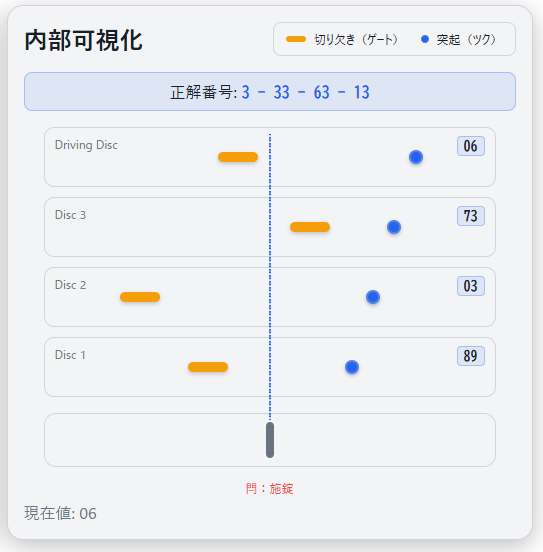

# DialSafe Simulator - Safe Dial Lock Simulator

**Day050 - 100 Security Tools with Generative AI**

👉 **Japanese version is available here: [README.md](README.md)**

The **DialSafe Simulator** is a browser-based visualization tool for learning the **legitimate opening procedures** and **internal mechanisms** of dial-type safes.

When you turn the dial, the **"Drive Cam → Each Wheel (Disk) → Gate → Fence"** interaction is displayed with animations, and the fence drops to unlock only when operated according to the correct procedure.

> This tool is designed for educational purposes (understanding legitimate operations) and does not cover attack or bypass techniques.

---

## 🌐 Demo Page

👉 **[https://ipusiron.github.io/dialsafe-simulator/](https://ipusiron.github.io/dialsafe-simulator/)**

Try it directly in your browser.

---

## 📸 Screenshots

>   
>
> *Unlocked state with gates aligned*
>
>   
>
> *Tsuku pins colliding with each other, with driving disk movement propagating to the 1st disk*

---

## ⚠️ Notice (Target Dial Lock Type)

Safe dial locks come in various types. This tool models and visualizes **4-disk fixed conversion dial locks commonly used in Japanese household safes**.

Actual specifications and structure may vary by manufacturer. This tool is a **simplified educational model**.

- Target: **4-disk fixed conversion dial locks**
- Assumptions: Scale "0–99", 4-number legitimate unlocking, "clockwise first" procedure common in Japanese products
- Not covered: Variable conversion types / Special mechanisms of commercial large safes / Electronic locks, etc.

> Use for purposes other than research and education (unauthorized access, property damage, etc.) is prohibited.

---

## ✨ Main Features
- **Interactive dial** (drag/buttons/keyboard)
- **Internal visualization**: Drive cam, gate positions of each disk, fence up/down
- **Legitimate unlocking simulator**: Tracks rotation direction and pass counts
- **Learning mode (LEARN)**: Key points of procedures, terminology explanations, demo playback
- **Challenge mode (CHALLENGE)**: Random combination legitimate unlocking challenge
- **Japanese/English switching**: Switchable UI language
- **High-speed operation**: Press and hold ±1 buttons for faster dial movement

---

## 🔩 Fixed Dial Lock Basics (4-disk, fixed conversion)

The following is an excerpt/summary from "Hacker's School Lock Picking Textbook" P451.

### Basic Structure of Fixed Dial Locks for Fire-resistant Safes

Main components and features:

- **Scale plate (knob)**: Operation part with 0-99 scale printed. Larger diameter indicates higher quality
- **Front seat (indexed base)**: Base with red indicator or cut line
- **1st to 3rd disks**: Each disk has 1 gate and 2 tsuku pins
- **Driving disk (drive seat)**: Larger than others, 1 tsuku pin, directly connected to scale plate via spindle
- **Spindle**: Central shaft through pipe, connected only to driving disk
- **Tension spring**: Keeps disks in contact, maintaining tsuku pin contact
- **L dimension**: Distance from front seat to driving disk, must be larger than door thickness

**Operating mechanism:**
Only the **driving disk** is directly connected to the scale plate via the spindle and is **driven** first. Other disks are **pressed together by tension springs**, and rotation is transmitted sequentially as **tsuku (pins)** of each disk hit each other. When springs weaken, tsuku pins slip and cause malfunction. Fault diagnosis: If load doesn't change when turning the scale plate, spring failure. Emergency measure: laying the safe down allows gravity to press disks together.

### Relationship between Fixed Dial Lock Mechanism and Key Mechanism
When viewed from above, the connection between the fixed dial lock and key lock appears as follows:

### Locked and Unlocked States of Dial Locks
Dial locks have multiple **disks** (circular plates) inside. For **4** disks, **4 numbers** are used for unlocking.

First, consider just **one** disk for understanding.

The disk has **one notch (gate)**, and if the **key side remains locked**, the bolt stays extended and the door won't open (Figure 1).

Even if the **key side is unlocked**, if the **dial side gate is not in unlock position**, the bolt **cannot be fully retracted** and the door won't open (Figure 2).

When the **key side is unlocked** and the **dial side gate is in unlock position**, the **bolt can be fully retracted** allowing the door to open (Figure 3).

The same applies to 4 disks - the door opens only when **4 gates align in a straight line** toward the bolt side and the **key side is unlocked**.

### Legitimate Unlocking Method for Dial Locks (4-disk, Japanese fixed dial)

**Dial setting** inputs 4 numbers in sequence. Here, "turn ○ times" means **the unlock number passes the indicator ○ times** (not "0"). **If you turn too much, start over**.

1. Turn **right** **4 or more times**, then stop at the **1st** number
2. Turn **left** **3 times**, then stop at the **2nd** number
3. Turn **right** **2 times**, then stop at the **3rd** number
4. Turn **left** **1 time**, then stop at the **4th** number

- ① completion aligns **1st disk** gate to unlock position
- ② completion aligns **2nd disk**
- ③ completion aligns **3rd disk**
- ④ completion aligns **driving disk**
→ **All 4 gates align** in position.

> Structurally, starting left can eventually align gates, but **number sequences are designed for right-start** (tsuku thickness error occurs). **Japanese products typically start right**, while Western products often start left.

Finally, **insert key and turn clockwise** to unlock. Pull while key remains in unlock position to open door (key serves as handle).

---

## ⌨ Controls (Tool)
- Rotation: `←` / `→`, Fine adjustment: `A` / `D`
- Execute: `Enter` (confirm procedure/challenge), Reset: `R`
- Language switch: Top-right selector (Japanese/English)

---

## 🛠 Technology Stack
- HTML / CSS / Vanilla JavaScript (no dependencies, GitHub Pages compatible)
- i18n (`data-i18n` attributes + localStorage for language persistence)

---

## 📄 License

MIT License - See [LICENSE](LICENSE) for details.

---

## 🚀 Future Improvements

### Complete Multilingual Support
Currently, there is an English switching function, but some illustration images contain Japanese explanations. For complete English support, English versions of the following images need to be created:

- `assets/AntiFire_DialLock_Component.png`: Component name diagram of fire-resistant safe fixed dial lock
- `assets/DialLock_Lock1.png`: Figure 1 (locked state) explanation
- `assets/DialLock_Lock2.png`: Figure 2 (partially unlocked) explanation
- `assets/DialLock_Lock3.png`: Figure 3 (fully unlocked) explanation
- `assets/dial_lock.png`: Fixed dial lock and key lock connection diagram

### Auto Unlock Feature Implementation
Currently, manual legitimate unlocking works perfectly, but auto unlock feature implementation has multiple technical challenges and was discontinued.

For detailed implementation considerations and challenges, see the following document:
👉 **[Auto Unlock Implementation Notes](AUTO_UNLOCK_IMPLEMENTATION_NOTES.md)**

Main challenges:
- **±1 operation difficulties**: Fine dial adjustment animation implementation
- **Pass counting function**: Accurately passing specified numbers the specified number of times
- **Animation control**: Automatic dial operation that traces the same movements as manual operation
- **Disk coupling reproduction**: Appropriate tsuku coupling timing at each step

### Other Improvement Ideas
- More detailed physical simulation (friction, spring elasticity, etc.)
- Sound effects (actual dial operation sounds)
- 3D visualization
- Support for different types of dial locks (variable conversion types, etc.)

---

## 🛠 About This Tool

This tool was developed as part of the "100 Security Tools with Generative AI" project.
This project creates and publishes various security-related tools over 100 days,
utilizing AI assistance.

For details about the project and other tools, please visit:

🔗 [https://akademeia.info/?page_id=42163](https://akademeia.info/?page_id=42163)
