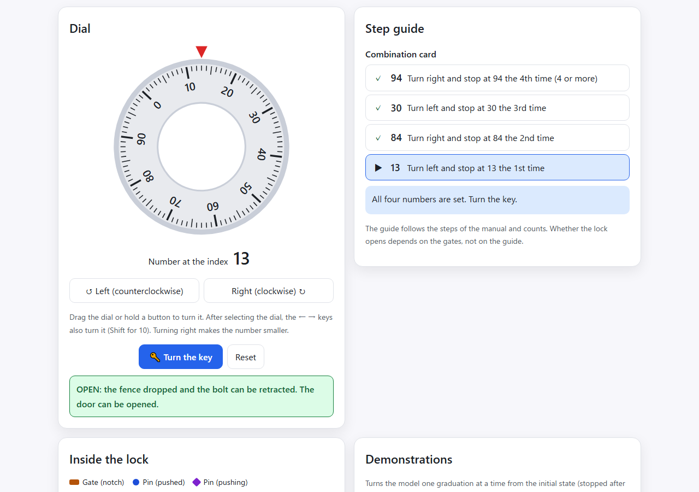
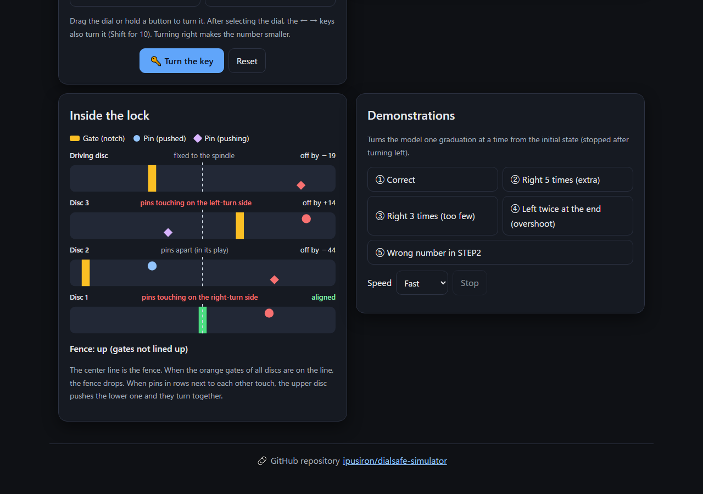
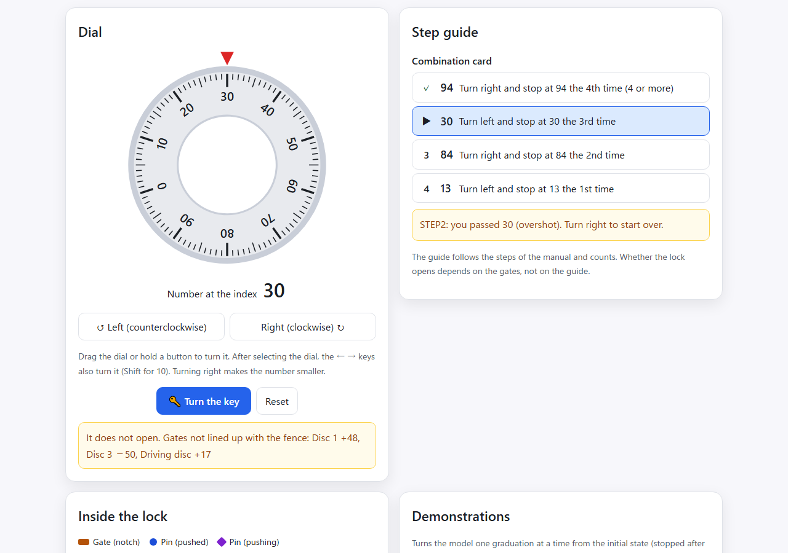
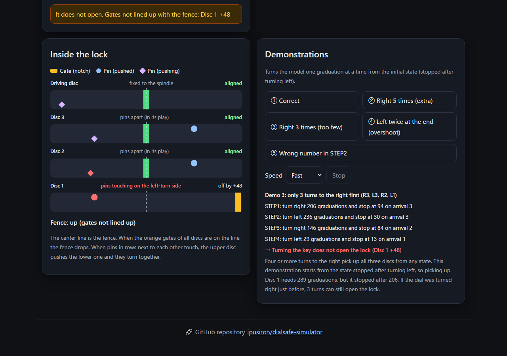
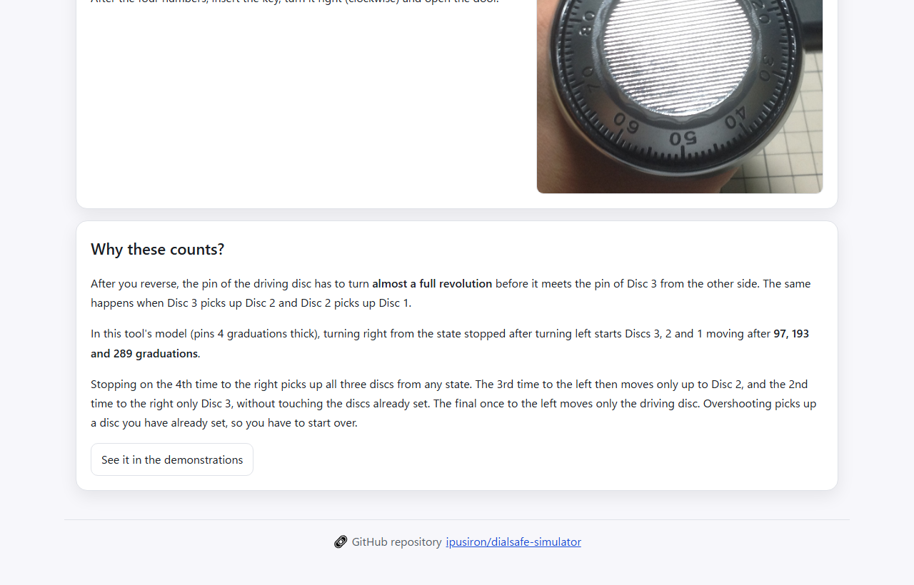

English · [日本語](README.md)

# DialSafe Simulator - Safe Dial Lock Simulator


[](https://ipusiron.github.io/dialsafe-simulator/)

**Day050 - 100 Security Tools with Generative AI**

DialSafe Simulator is a browser-based visualization tool for learning the legitimate way to open a dial safe and what moves inside it. It models the "4-disc fixed dial lock" common in Japanese home fire-resistant safes as a chain of play between pins (tsuku). When you turn the dial, you can watch the pin of the driving disc travel almost a full revolution before it picks up the next disc and moves its gate. Whether the lock opens depends only on the gate positions, so the model itself shows why "right 4, left 3, right 2, left 1" opens the lock and why overshooting does not.

The tool has two tabs.

1. Learn: explains the structure of the fixed dial lock, how it opens, how to operate it, and what the counts in the steps mean
2. Simulator: open the lock with a dial that turns the same way as a real one, with a step guide, a view inside the lock and demonstrations

> This tool is for education (understanding legitimate operation) and does not cover attack or bypass techniques.

---

## 🌐 Demo

👉 **[https://ipusiron.github.io/dialsafe-simulator/](https://ipusiron.github.io/dialsafe-simulator/)**

Try it directly in your browser.

---

## 📸 Screenshots

>
>
>*The dial turned as on the combination card (94-30-84-13), then the key turned: OPEN*

>
>
>*100 graduations to the left in STEP2. The pin of the driving disc has met the pin of Disc 3, and Disc 3 starts turning with it (dark)*

>
>
>*Passing 30 in STEP2 makes the guide warn about the overshoot. Turning the key does not open the lock, because Disc 1 was picked up and moved*

>
>
>*Demonstration 3 (only 3 turns to the right first). It explains, in graduations, why stopping before Disc 1 is picked up leaves the lock closed (dark)*

>
>
>*"Why these counts?" on the Learn tab, showing from the model how many graduations it takes before each disc starts moving (97, 193, 289)*

---

## 🔐 Target dial lock

Safe dial locks come in many types. This tool models and visualizes the "4-disc fixed dial lock (fixed conversion dial lock)" widely used in Japanese home safes.


The structure and procedure may differ by manufacturer and model. This tool is a simplified model for education.

- Target: 4-disc fixed dial lock (fixed conversion dial lock)
- Assumptions: scale 0–99, legitimate opening with 4 numbers, the "turn right first" procedure common in Japanese products
- Not covered: variable conversion types, special mechanisms of other standards or large commercial safes, electronic locks and so on

> Use for anything other than research and education (unauthorized access, property damage and so on) is prohibited.

---

## ✨ Features

### 📚 Learn tab

- What a fixed dial lock is, its structure (main components), how it opens (Figures 1–3), and how to operate it (the four steps and how to count)
- Right and left: right is clockwise. The scale increases clockwise, so turning right makes the number under the index smaller (with a photo of a real dial)
- Why these counts: shows from the model how many graduations it takes before each disc starts moving, and how many discs each step moves

### 🎛️ Simulator

- A dial with a scale (0–99, increasing clockwise). Turning right (clockwise) makes the number smaller. The number at the index is shown large in a box that does not turn
- How to turn: drag the dial, use the "Right" and "Left" buttons (hold to keep turning), or select the dial and use the ← → keys (Shift for 10 graduations)
- Step guide: shows where you are in the four steps of the combination card, how many times the number has come to the index, and warns about overshooting, reversing at the wrong place, or starting to the left
- Turn the key: opens if the four gates are lined up with the fence. Otherwise it lists the discs that are off and by how many graduations
- Inside the lock: draws the gate and two kinds of pins (pushed and pushing) of each disc on horizontal strips, and colors the discs whose pins are touching and the gates that are lined up

### 🎬 Demonstrations

- Five demonstrations that turn the model one graduation at a time from the initial state (stopped after turning left)
- ① correct, ② right 5 times (extra), ③ right 3 times (too few), ④ left twice at the end (overshoot), ⑤ wrong number in STEP2
- The log shows how many graduations each step turned, the result of turning the key, and why the lock did not open. You can choose the speed (slow, normal, fast) and stop a demonstration

### 🌐 Interface

- Japanese and English (`?lang=ja`, `?lang=en`; the choice is saved), light and dark themes (also follows the OS setting)
- No horizontal overflow even on a 390px-wide smartphone. Buttons are at least 44px tall
- Tabs can also be moved with the arrow keys, Home and End. The step guide and results are announced to screen readers (aria-live)
- Works when index.html is opened directly as a file (built with plain scripts)

---

## 📖 Usage

1. Open the Simulator tab. The initial state is stopped after turning left (all three discs have their pins touching on the left-turn side)
2. Following the combination card, turn right and stop at 94 the 4th time (let 94 pass the index 3 times and stop exactly when it comes the 4th time)
3. Reverse, turn left and stop at 30 the 3rd time. Then turn right and stop at 84 the 2nd time, and turn left and stop at 13 the 1st time
4. Press "Turn the key". If the four gates are lined up, the lock opens. If not, the discs that are off are listed, so reset and try again
5. In "Inside the lock", watch the moment a pin meets another and the discs start turning together
6. In the demonstrations, see why the lock does not open when the counts change or a number is wrong

---

## 🔩 Fixed dial lock basics (4 discs, fixed conversion)

The following is an excerpt and summary from ["Hacker's School Lock Picking Textbook"](https://akademeia.info/?page_id=299), p. 451.

### Basic structure of the fixed dial lock in a fire-resistant safe

The main components and their features are as follows.

- Dial (knob): the operating part printed with the 0–99 scale. A larger diameter means a higher grade
- Base plate (with index): a base with a red index or a cut line
- Discs 1–3: each disc has 1 gate and 2 pins
- Driving disc: larger than the others, with 1 pin, connected directly to the dial by the spindle
- Spindle: the central shaft through the tube, connected only to the driving disc
- Tension spring: presses the discs together and keeps the pins in contact
- L dimension: the distance from the base plate to the driving disc; must be larger than the door thickness


Only the driving disc is connected directly to the dial through the spindle, so it is driven first. The other discs are pressed together by the tension spring, and the pins (tsuku) of the discs pass the rotation on as they meet.

If the spring weakens, the pins slip and the lock fails. Diagnosis: if the load does not change when you turn the dial, the spring has failed. As a stopgap, laying the safe on its back lets gravity press the discs together.


### How the fixed dial lock works with the key lock

Seen from above, the link between the fixed dial lock and the key lock looks like this.


### Locked and unlocked states

A dial lock has several discs inside. With 4 discs, 4 numbers are used to open it.

First, consider just one disc.

The disc has one notch (gate). If the key side stays locked, the bolt stays out and the door does not open (Figure 1).


Even if the key side is unlocked, the bolt cannot be fully retracted unless the gate on the dial side is in the unlocking position, so the door does not open (Figure 2).


When the key side is unlocked and the dial-side gate is in the unlocking position, the bolt can be fully retracted and the door opens (Figure 3).


The same applies to 4 discs: the door opens only when the 4 gates line up toward the bolt and the key side is unlocked.

### The legitimate way to open (4 discs, Japanese fixed dial)


The four numbers are entered in order by setting the dial. "Turn ○ times" means the number itself passes the index ○ times (not "0"). **If you overshoot, start over**.

1. Turn right 4 or more times, then stop at the 1st number
2. Turn left 3 times and stop at the 2nd number
3. Turn right 2 times and stop at the 3rd number
4. Turn left once and stop at the 4th number

- Step ① puts the gate of Disc 1 in the unlocking position
- Step ② does the same for Disc 2
- Step ③ for Disc 3
- Step ④ for the driving disc
- → All 4 gates line up

> Structurally, the gates can also be lined up when starting to the left, but the numbers are designed for starting to the right (otherwise an error of the pin thickness appears). **Japanese products usually start to the right**, while many Western ones start to the left.

Finally, insert the key and turn it clockwise to unlock. Pull while the key is in the unlocking position to open the door (the key works as the handle).

---

## 🔬 How the model works and how it was checked

The tool computes the movement of the discs as a chain of play between pins (`js/dial-core.js`).

- The unit is the graduation (one revolution = 100). Turning right (clockwise) by one graduation lowers the number at the index by 1, and turning left raises it by 1
- The driving disc is fixed to the spindle and turns exactly with the dial
- Discs 3, 2 and 1 can play within 0–96 graduations of the angle of the disc driving them. Outside that range, they are pushed by the pins and turn together (96 = 100 − pin thickness 4)
- The fence drops when all four gates are within ±1 graduation of the fence
- The gate positions are worked back from the combination 94-30-84-13 (Discs 1 and 3, stopped while pushed to the right, match their numbers; Disc 2, stopped while pushed to the left, is offset by two plays)

Turning right from the state stopped after turning left, Discs 3, 2 and 1 start moving after 97, 193 and 289 graduations. Stopping on the 4th time to the right always exceeds 289 graduations, so all three discs are picked up from any state. The 3rd time to the left moves only up to Disc 2, and the 2nd time to the right only up to Disc 3, without touching the discs already set.

The table shows how often turning the key opened the lock for each way of dialing, over 2,000 random initial states (fixed seed).

| Dialing | Opened |
|---|---|
| Correct steps (R4, L3, R2, L1) | 100.0% |
| Right 5 times first | 100.0% |
| Right 3 times first | 97.0% |
| Left 4 times in STEP2 (overshoot) | 0.0% |
| Right 3 times in STEP3 (overshoot) | 0.0% |
| Left twice in STEP4 (overshoot) | 0.0% |
| STEP2 number off by 1 graduation | 100.0% |
| STEP2 number off by 2 graduations | 0.0% |
| Starting left (L4, R3, L2, R1), same numbers | 0.0% |
| Starting left, numbers shifted by the pin thickness (82-38-80-13) | 100.0% |

- The 3.0% that did not open with right 3 times first are the cases that stopped before Disc 1 was picked up. If the dial was turned right 4 or more times just before, right 3 times also opens the lock
- The result of starting left matches "the numbers are designed for starting to the right" in the section above. The pushing side is reversed, so the gates are off by the pin thickness
- The step guide only follows the manual and counts; it plays no part in deciding whether the lock opens
- The tests (`test/model.test.js`, `test/readme.test.js`) recompute the values in the table

---

## 🎯 Use cases

- Classes and training: in physical security or mechanism classes, show with the moving model that the counts in the steps come from picking up the discs one at a time
- Safe owners: understand what the steps in your safe's manual mean, and why you start over after overshooting
- Lock and locksmith courses: help explain the structure of the fixed dial lock (gates, pins, fence) within legitimate operation
- Crime prevention awareness: convey, together with its structure, that the fixed dial lock "has the simplest structure and does not offer particularly high security"
- Puzzle and escape game design: explain dial lock gimmicks and check numbers and turning directions
- Exhibitions: supplement real locks in museums or corporate displays by showing what moves inside
- Fiction and scripts: check the steps and movements of a scene where a character opens a safe with the correct combination
- Learning programming and mechanical design: read a model of chained play (backlash), checks with a fixed seed, and an SVG interface in a small codebase

This tool is for learning legitimate operation and is not intended for opening other people's safes. Please do not misuse it.

---

## 🔒 Security and privacy

- Everything you do is processed only inside the browser and nothing is sent anywhere
- A Content Security Policy (meta) limits scripts and styles to files from the same place, allows no inline scripts or styles, and allows no connections to other sites
- Text on the page is shown only with `textContent` (never interpreted as HTML). Diagrams are drawn with SVG attributes
- Only the language and theme choices are saved in the browser. The tool works even where they cannot be saved
- Keys are handled only while the dial has focus (the tool does not take over keys on the whole page)
- External links use `rel="noopener noreferrer"` and send no referrer

---

## ⚠️ Notes and limitations

- This is a simplified model for education. The pin thickness (4 graduations) and tolerance (±1 graduation) are this tool's values; real dimensions, tolerances and combination restrictions differ by manufacturer and model. Friction and spring forces are not modeled
- The combination 94-30-84-13 is a fictional number for this tool
- The target is the 4-disc fixed dial lock that starts to the right. Variable conversion types, electronic locks and types that start to the left are not covered
- Techniques for defeating locks (such as finding numbers from the feel of the dial) are not covered
- Demonstration 3 starts from the state stopped after turning left. Depending on the initial state, right 3 times can also open the lock

---

## 🧪 Tests

```bash
npm test
```

- Runs on the standard Node.js 22+ test runner (`node:test`) with no dependencies. GitHub Actions runs it on every push and pull request
- Model: with the same 2,000 initial states as a separately written reference implementation, the results of the correct steps, overshooting, too few turns, wrong numbers and starting left match; the play always stays within 0–96; and the discs start moving after 97, 193 and 289 graduations
- The step guide (counting, overshooting, reversing at the wrong place, starting to the left), and the results of the five demonstrations and which disc ends up off
- index.html CSP, ARIA, image alt text and agreement with the dictionary, the Japanese and English dictionaries, language selection, color contrast (text 4.5:1 and graphics 3:1 or more, in light and dark), and line length
- The tables and numbers in both READMEs (the 2,000-state rates, graduation counts, numbers for starting left), the directory tree and the images are also checked against the implementation

---

## 📁 Directory structure

```
dialsafe-simulator/
├── .github/                           # GitHub settings
│   └── workflows/                     # GitHub Actions
│       └── test.yml                   # Runs npm test on push and pull request
├── assets/                            # Images
│   ├── en/                            # Screenshots for the English README
│   │   ├── screenshot.png             # Opened with the correct steps
│   │   ├── screenshot2.png            # A pin meets and picks up Disc 3
│   │   ├── screenshot3.png            # Overshoot warning
│   │   ├── screenshot4.png            # Demonstration 3
│   │   └── screenshot5.png            # Why these counts
│   ├── AntiFire_DialLock_Component.png # Cross-section (names of the parts)
│   ├── DialLock.jpg                   # A fixed dial lock
│   ├── DialLock1.jpg                  # The four discs seen from the side
│   ├── DialLock2.jpg                  # Seen from behind
│   ├── DialLock3.jpg                  # The driving disc
│   ├── DialLock5.jpg                  # The dial scale
│   ├── DialLock_Lock1.png             # Figure 1: locked
│   ├── DialLock_Lock2.png             # Figure 2: some gates lined up
│   ├── DialLock_Lock3.png             # Figure 3: unlocked
│   ├── dial_lock.png                  # How the dial lock works with the key lock
│   ├── screenshot.png                 # Screenshot for the Japanese README (opened)
│   ├── screenshot2.png                # Screenshot for the Japanese README (picking up Disc 3)
│   ├── screenshot3.png                # Screenshot for the Japanese README (overshoot)
│   ├── screenshot4.png                # Screenshot for the Japanese README (demonstration 3)
│   └── screenshot5.png                # Screenshot for the Japanese README (why these counts)
├── css/                               # Styles
│   └── style.css                      # Page styles (light and dark colors)
├── js/                                # Page scripts (plain scripts that work from file://)
│   ├── dial-core.js                   # Core (pin-play model, step guide, demonstrations, view)
│   ├── i18n.js                        # Language selection and static text
│   ├── messages.js                    # Japanese and English text
│   ├── script.js                      # Page logic
│   ├── theme-init.js                  # Applies the theme before drawing
│   └── theme.js                       # Light and dark switching
├── test/                              # node:test tests
│   ├── contrast.test.js               # Color contrast and button height
│   ├── demo.test.js                   # Demonstration results
│   ├── format.test.js                 # Line length and line endings
│   ├── guide.test.js                  # Step guide
│   ├── html.test.js                   # CSP, ARIA, images, agreement with the dictionary
│   ├── i18n.test.js                   # Language selection
│   ├── load.js                        # Loads the plain scripts into the tests
│   ├── messages.test.js               # Japanese and English dictionaries
│   ├── model.test.js                  # Model (agreement with the reference, play, pick-up)
│   └── readme.test.js                 # README tables, numbers, tree and images
├── .gitignore                         # Files Git ignores
├── .nojekyll                          # Tells GitHub Pages not to use Jekyll
├── CLAUDE.md                          # Development guide (for Claude Code)
├── LICENSE                            # MIT License
├── README.en.md                       # This document
├── README.md                          # Japanese README
├── index.html                         # The page
└── package.json                       # npm test settings
```

---

## 💻 Requirements

- Checked on the latest Chrome, Edge and Firefox
- Works when index.html is opened directly as a file. The tests need Node.js 22 or later

---

## 📄 License

- See the `LICENSE` file for the source code license.

---

## 🛠️ About this tool

This tool was developed as part of the "100 Security Tools with Generative AI" project.
The project builds and publishes a variety of security-related tools over 100 days with the help of AI.

For details about the project and other tools, see the page below.

🔗 [https://akademeia.info/?page_id=42163](https://akademeia.info/?page_id=42163)
