<!--
---
id: day050
slug: dialsafe-simulator

title: "DialSafe Simulator"

subtitle_ja: "金庫ダイヤルシミュレーター"
subtitle_en: "Safe Dial Lock Simulator"

description_ja: "4枚座の固定ダイヤル錠の正規開錠手順と内部構造をブラウザー上でインタラクティブに可視化する教育ツール"
description_en: "An interactive educational tool to visualize the legitimate unlocking procedure and internal mechanics of 4-disk fixed-conversion dial locks"

category_ja:
  - 物理セキュリティ
  - 鍵開け
category_en:
  - Physical Security
  - Lock Picking

difficulty: 2

tags:
  - dial-lock
  - safe
  - locksport
  - physical-security
  - education
  - visualization
  - interactive

repo_url: "https://github.com/ipusiron/dialsafe-simulator"
demo_url: "https://ipusiron.github.io/dialsafe-simulator/"

hub: true
---
-->

[English](README.en.md) · 日本語

# DialSafe Simulator - 金庫ダイヤルシミュレーター


[](https://ipusiron.github.io/dialsafe-simulator/)

**Day050 - 生成AIで作るセキュリティツール100**

DialSafe Simulatorは、ダイヤル式金庫の正規の開け方と内部の動きを、ブラウザー上で学べる可視化ツールです。日本の家庭用耐火金庫に多い「4枚座の固定ダイヤル錠」を、ツク（突起）同士の遊びの連鎖として模型にしています。ダイヤルを回すと、ドライビングディスクのツクがほぼ1回転してから次のディスクを拾い、ゲートが動く様子がそのまま見えます。開くかどうかはゲートの位置だけで決まるので、「右に4回・左に3回・右に2回・左に1回」で開く理由と、回し過ぎると開かない理由が、模型の動きから分かります。

本ツールは2つのタブで構成しています。

1. 学習（Learn）: 固定ダイヤル錠の構造・開錠の仕組み・操作法と、手順の回数の意味を解説する
2. シミュレーター（Simulator）: 実機と同じ向きのダイヤルを回して開ける。手順ガイド・内部の動き・自動実演・練習モード・振り返りつき

> 本ツールは教育（正規操作の理解）を目的とし、攻撃・バイパス手法は扱いません。

---

## 🌐 デモページ

👉 **[https://ipusiron.github.io/dialsafe-simulator/](https://ipusiron.github.io/dialsafe-simulator/)**

ブラウザーで直接お試しいただけます。

---

## 📸 スクリーンショット

>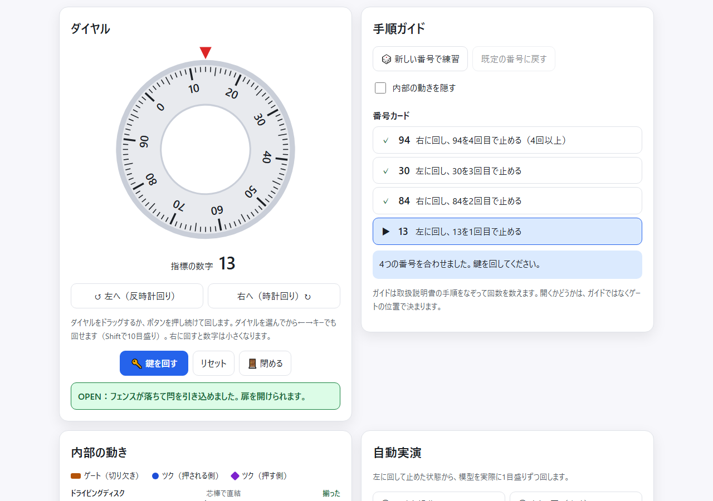
>
>*番号カード（94-30-84-13）のとおりに回して鍵を回し、OPENになったところ*

>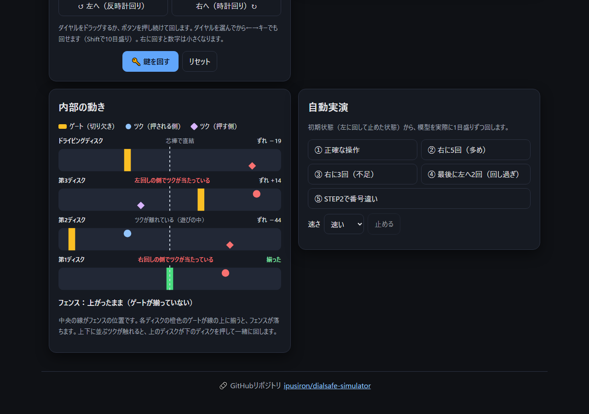
>
>*STEP2で左へ100目盛り回したところ。ドライビングディスクのツクが第3ディスクのツクに当たり、一緒に回り始めた（ダーク）*

>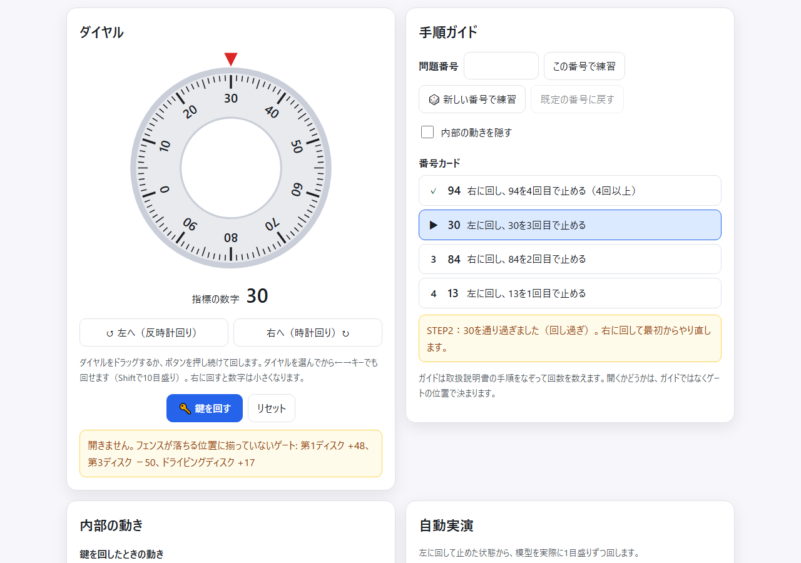
>
>*STEP2で30を通り過ぎると、ガイドが回し過ぎを知らせる。鍵を回しても、拾ってしまった第1ディスクがずれていて開かない*

>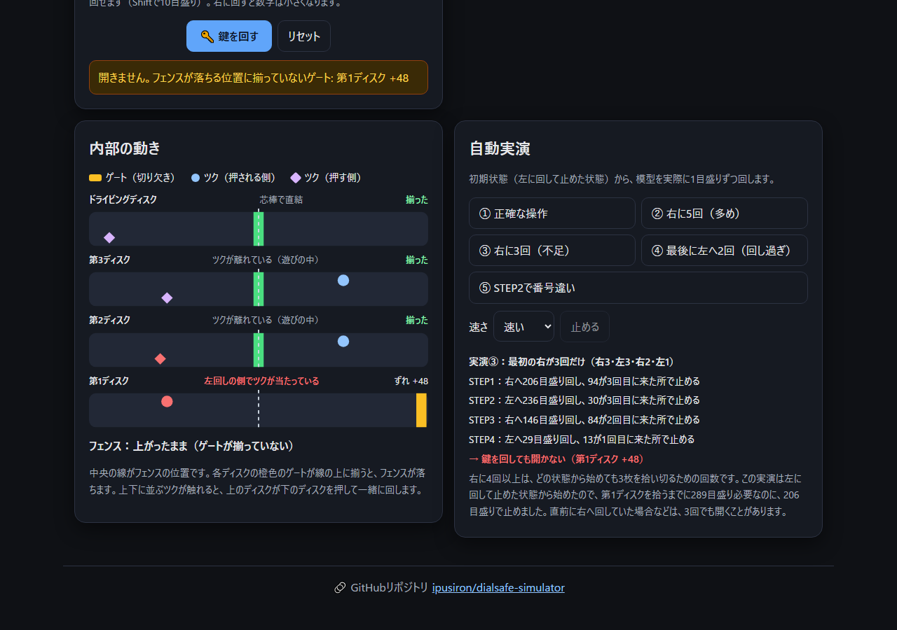
>
>*自動実演③（最初の右が3回だけ）。第1ディスクを拾い切る前に止めたので開かない理由を、目盛り数で説明する（ダーク）*

>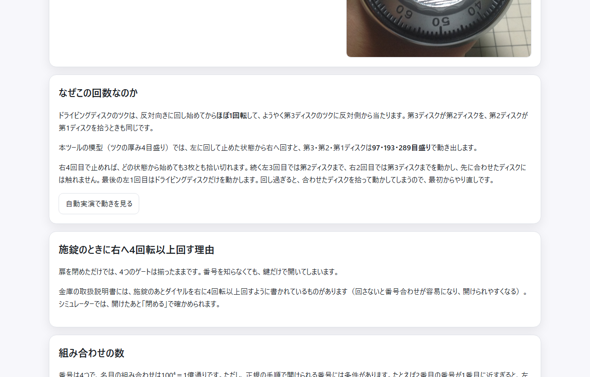
>
>*学習タブの「なぜこの回数なのか」。ディスクが動き出すまでの目盛り数（97・193・289）を模型の値で示す*

>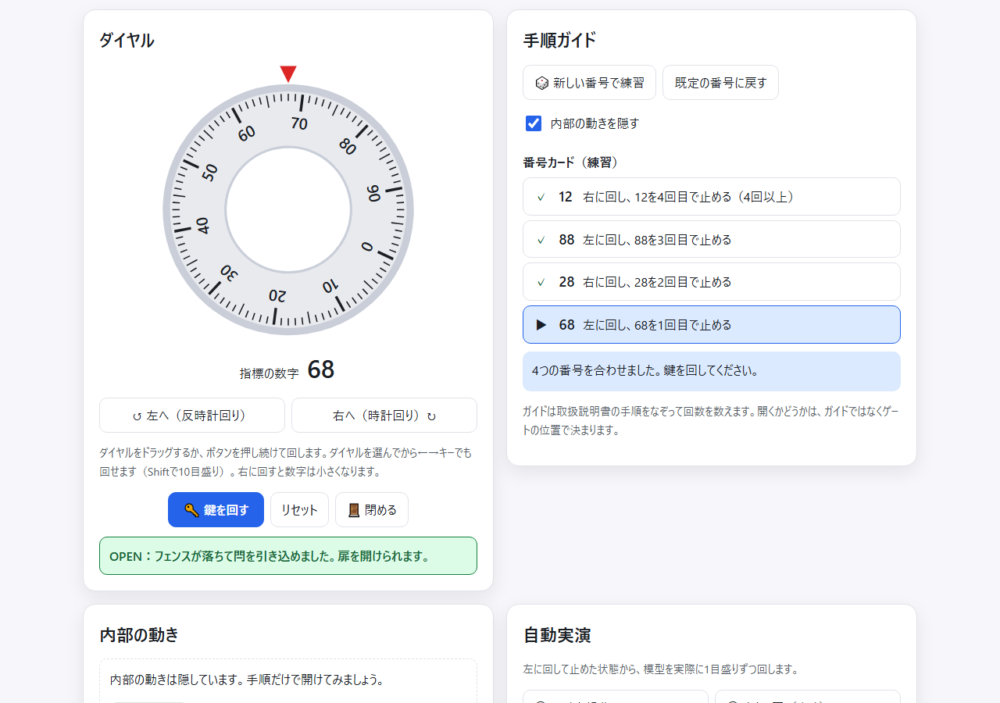
>
>*練習モード。問題番号で決まる番号カード（12-88-28-68）と初期状態から、内部を隠して手順だけで開けたところ*

>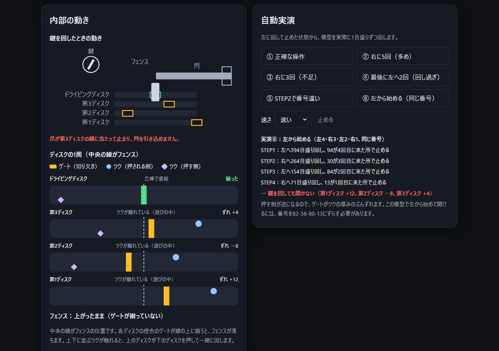
>
>*自動実演⑥（左から始める）。押す側が逆になり、同じ番号ではゲートがツクの厚みのぶんずれて開かない（ダーク）*

>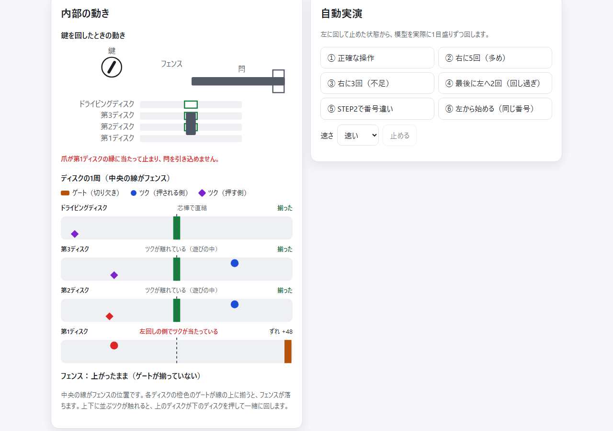
>
>*STEP2で回し過ぎてから鍵を回したところ。フェンスの爪は3枚のゲートを通るが、ずれた第1ディスクの縁で止まる*

>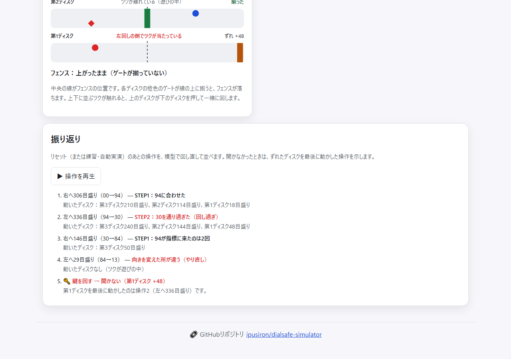
>
>*同じ操作の振り返り。区切りごとに動いたディスクとガイドの判定を並べ、第1ディスクを最後に動かしたのは操作2（左へ336目盛り）だと示す*

---

## 🔐 対象とするダイヤル錠

金庫のダイヤル錠には多様な方式があります。本ツールは、日本で広く普及する家庭用の「4枚座の固定ダイヤル錠（固定変換ダイヤル錠）」を簡易モデル化して可視化しています。

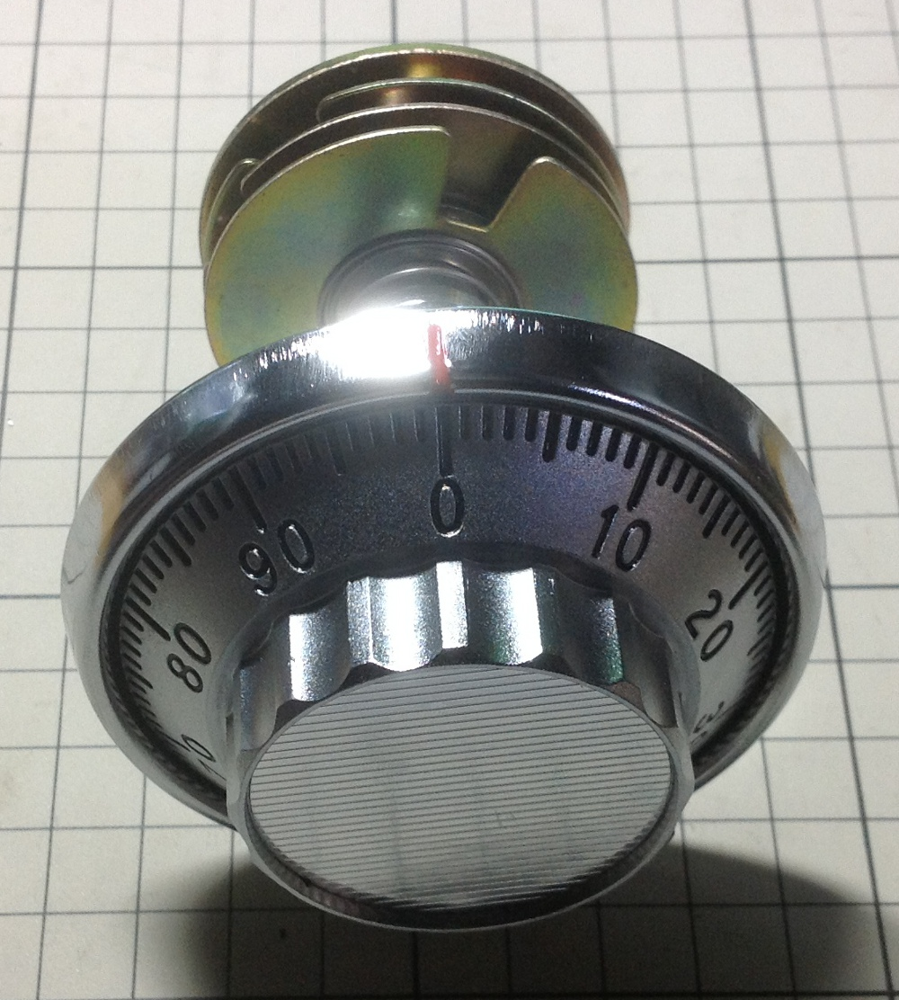

実機仕様・メーカー差によって構造や操作手順は異なる場合があります。本ツールは教育用の簡略化モデルです。

- 対象: 4枚座の固定ダイヤル錠（固定変換ダイヤル錠）
- 想定: 目盛「0–99」、4番号の正規解錠、国産機で一般的な「最初は右回し」手順
- 非対象: 可変変換型／別規格・商用大型金庫の特殊機構／電子錠など

> 研究・教育以外の目的（不正アクセス・器物損壊等）での利用を禁止します。

---

## ✨ 機能

### 📚 学習タブ

- 固定ダイヤル錠とは、構造（主要部品）、開錠メカニズム（図1〜3）、操作法（4つの手順と回数の数え方）
- 右・左の向き: 右は時計回り。目盛りは時計回りに増えるので、右に回すと指標の下の数字は小さくなる（実機の写真つき）
- なぜこの回数なのか: ディスクが動き出すまでの目盛り数を模型の値で示し、各手順で何枚のディスクを動かすかを説明する
- 施錠のときに右へ4回転以上回す理由: 扉を閉めただけではゲートが揃ったままで、鍵だけで開いてしまうことを説明する
- 組み合わせの数: 名目の100⁴＝1億通りと、正規の手順でゲートがぴったり揃う組み合わせの数（模型の値）

### 🎛️ シミュレーター

- 目盛りつきのダイヤル（0〜99、時計回りに増える）。右（時計回り）に回すと数字が減る。指標の数字は回らない枠に大きく出す
- 回し方: ダイヤルのドラッグ、「右へ」「左へ」ボタン（押し続けると連続で回る）、ダイヤルを選んでから←→キー（Shiftで10目盛り）
- 手順ガイド: 番号カードの4つの手順のどこにいるか、番号が指標に来た回数、回し過ぎ・向きを変える所の誤り・左から始めたことを知らせる
- 鍵を回す: 4つのゲートがフェンスの位置に揃っていれば開く。開かなければ、ずれているディスクとずれ（目盛り）を出す
- 内部の動き: 各ディスクのゲートと2種類のツク（押される側・押す側）を横の帯で描く。ツクが当たっているディスクと、揃ったゲートを色で示す
- 閉める: 開けたあと扉を閉める。ダイヤルを右に4回転以上回すと「番号を崩した」と知らせ、崩さずに鍵を回すと開いてしまうことを示す
- 鍵を回したときの動き: フェンスの真下の窓に4枚のゲートを描き、鍵を回すと爪が下りる。4枚とも通れば爪が落ちて閂が引き込まれ、通れなければ爪が止まるディスクを示す
- 練習モード: 問題番号（1〜999999）で決まる番号カードと初期状態で練習する。同じ番号なら同じ問題になるので、授業などで共有できる。内部の動きを隠せる（隠しているあいだは、開かない理由も伏せる）
- 振り返り: リセット（または練習・自動実演）のあとの操作を模型で回し直し、区切りごとに回した目盛り数・動いたディスク・ガイドの判定を並べる。開かなかったときは、ずれたディスクを最後に動かした操作を示す。「操作を再生」で、自分の操作をもう一度動かして見られる

### 🎬 自動実演

- 左に回して止めた状態から、模型を実際に1目盛りずつ回す6つの実演（練習モードでは練習の番号で回す）
- ①正確な操作、②右に5回（多め）、③右に3回（不足）、④最後に左へ2回（回し過ぎ）、⑤STEP2で番号違い、⑥左から始める（同じ番号）
- 各手順で回した目盛り数、鍵を回した結果、開かなかった理由を記録に出す。速さ（ゆっくり・ふつう・速い）を選べ、途中で止められる

### 🌐 画面

- 日本語・英語の切り替え（`?lang=ja`・`?lang=en`、選択は保存）、ライト・ダークの切り替え（OSの設定にも従う）
- 幅390pxのスマートフォンでも横にはみ出さない。ボタンは高さ44px以上
- タブは矢印キー・Home・Endでも移れる。手順ガイドと結果は読み上げにも伝わる（aria-live）
- index.htmlをファイルとして直接開いても動く（通常のスクリプトで作っている）

---

## 📖 使い方

1. シミュレーターのタブを開く。初期状態は、左に回して止めた状態（3枚のディスクとも、左回しの側でツクが当たっている）
2. 番号カードを見ながら、右に回して94を4回目で止める（94が指標の前を3回通り過ぎ、4回目でちょうど止める）
3. 向きを変え、左に回して30を3回目で止める。続けて右に回して84を2回目、左に回して13を1回目で止める
4. 「鍵を回す」を押す。4つのゲートが揃っていれば開く。開かなければ、ずれているディスクが表示されるので、リセットしてやり直す
5. 内部の動きで、ツクが当たってディスクが一緒に回り始める瞬間を見る
6. 自動実演で、回数を変えたときや番号を間違えたときに開かない理由を見る
7. 開けたあと「閉める」を押し、すぐ鍵を回すと開いてしまうことと、右に4回転以上回して番号を崩すと開かなくなることを確かめる
8. 「新しい番号で練習」（または問題番号を入れて「この番号で練習」）で、番号カードを手順だけで開ける。「内部の動きを隠す」を付けると、実機と同じく中が見えない
9. 開かなかったら、振り返りで、どの操作がどのディスクを動かしたかを確かめる

---

## 🔩 固定ダイヤル錠の基礎（4枚座・固定変換）

以下は[『ハッカーの学校 鍵開けの教科書』](https://akademeia.info/?page_id=299) P451よりの抜粋・要約です。

### 耐火金庫の固定ダイヤル錠の基本構造

主要部品と特徴は次のとおりです。

- 目盛盤（つまみ）：0-99の目盛りが印字された操作部。直径が大きいほど高級品
- 表座（指標つき台座）：赤い指標または切り込み線付きの台座
- 第1〜第3ディスク：各ディスクにゲート1個とツク2個を配置
- ドライビングディスク（駆動座）：他より大きく、ツク1個、目盛盤と芯棒で直結
- 芯棒：パイプ内を通る中心軸、ドライビングディスクのみと接続
- テンションスプリング：各ディスクを密着させ、ツク同士の接触を保つ
- L寸法：表座からドライビングディスクまでの距離、扉厚より大きく必要

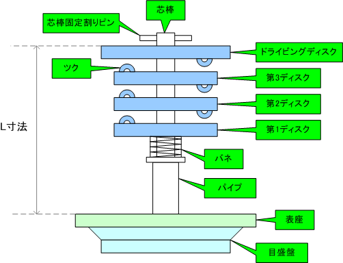

芯棒を介してドライビングディスクのみが目盛盤と直結し、まずドライブされます。他ディスクはテンションスプリングで密着しており、各ディスクのツク（突起）同士が当たりながら順次回転を伝達します。

バネが弱くなるとツクが空回りして故障の原因となります。故障診断：目盛盤を回しても負荷が変わらない場合はバネ故障。応急処置として金庫を寝かせると重力でディスクが密着します。

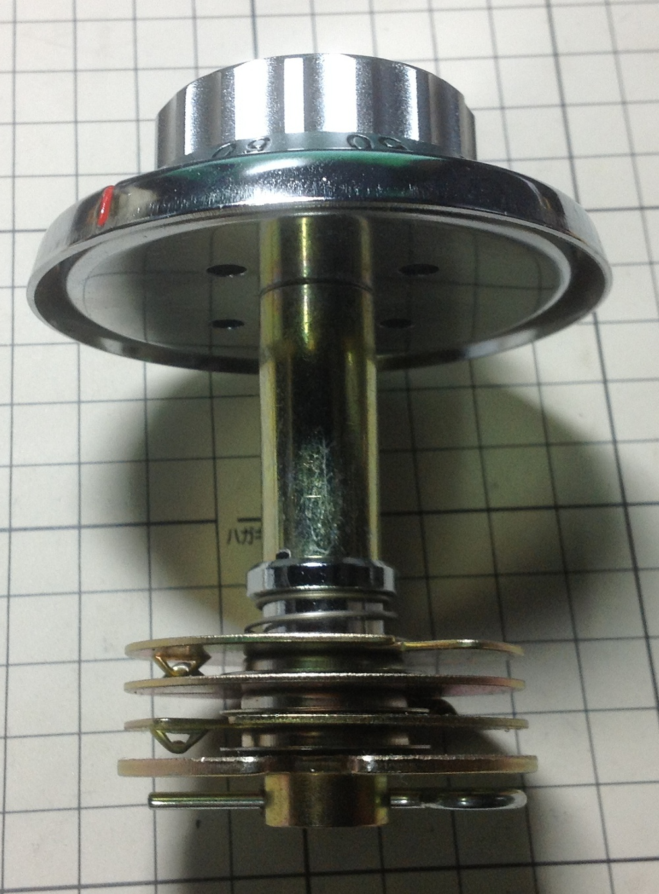
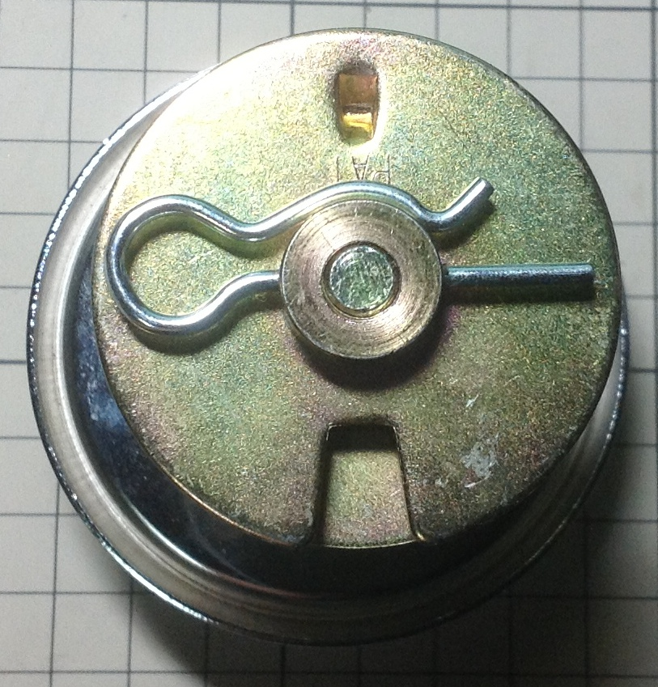
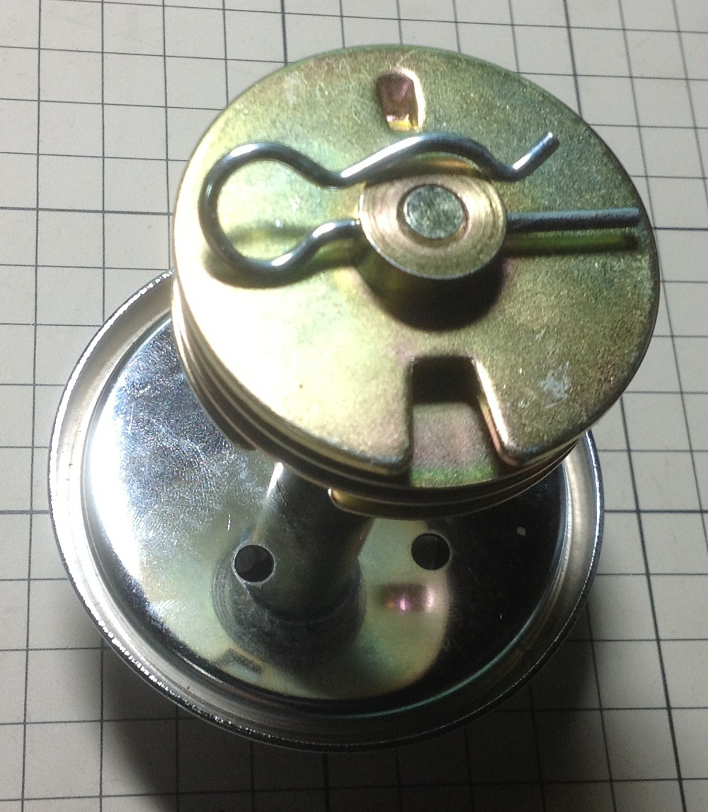

### 固定ダイヤル錠機構と鍵機構の関連性

固定ダイヤル錠と鍵の錠前の連動部を上から見ると、次のようになります。

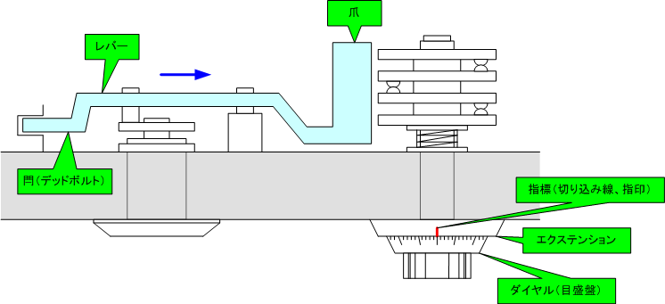

### ダイヤル錠の施解錠の状態

ダイヤル錠は内部に複数のディスク（円板）を持ちます。4枚のディスクなら、解錠には4つの数字を用います。

まず理解のために1枚の円板だけを考えます。

円板には1つの切り欠き（ゲート）があり、鍵側が施錠のままなら閂は出たままで扉は開きません（図1）。

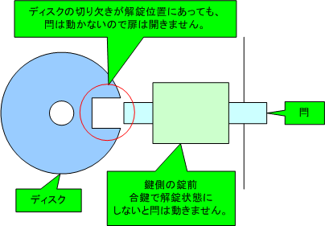

鍵側を解錠しても、ダイヤル側のゲートが解錠位置でなければ閂を完全に引き込めず、扉は開きません（図2）。

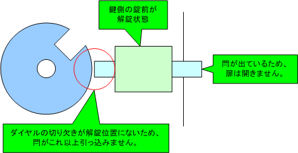

鍵側が解錠かつダイヤル側のゲートが解錠位置にあると、閂を完全に引き込めるため扉が開きます（図3）。

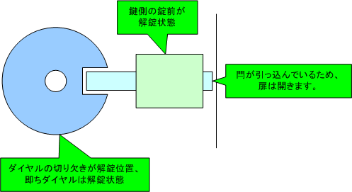

4枚ディスクでも同様で、4つのゲートが閂側に一直線に揃い、加えて鍵側が解錠されてはじめて扉が開きます。

### ダイヤル錠の正規の解錠法（4枚座・国産固定ダイヤル）

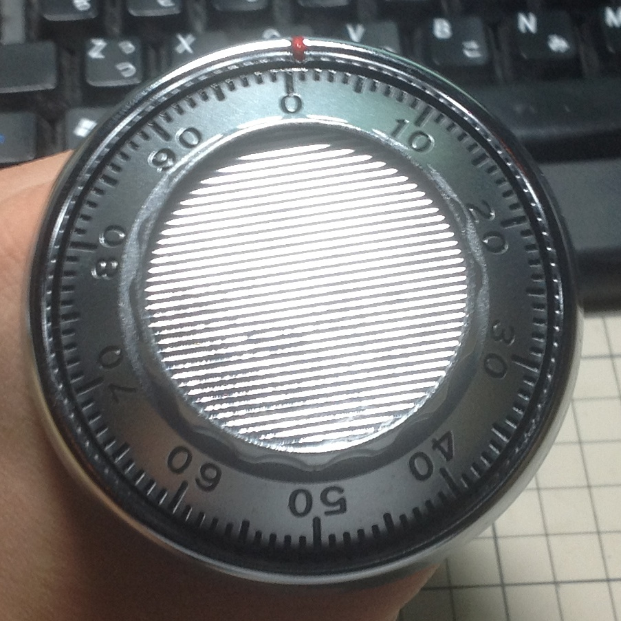

ダイヤル合わせで4番号を順に入力します。ここでの「○回まわす」は、解錠の数値が指標を○回通過する意味です（「0」ではありません）。**回し過ぎたらやり直し**です。

1. 右に4回以上まわしてから、1番目の数値で停止
2. 左に3回まわして、2番目の数値で停止
3. 右に2回まわして、3番目の数値で停止
4. 左に1回まわして、4番目の数値で停止

- ①完了で第1ディスクのゲートが解錠位置
- ②完了で第2ディスク
- ③完了で第3ディスク
- ④完了でドライビングディスク
- → 4枚すべてのゲートが揃う状態になる

> 構造上、左始動でも最終的にゲートを揃えることは可能ですが、番号列は右始動前提で設計されています（ツク厚み分の誤差が出るため）。**国産は右始動が一般的**、欧米は左始動が多い点にも注意。

最後に鍵を挿入して時計回りに回転し、解錠します。鍵の解錠位置のまま引くことで扉を開けます（鍵がつまみの役割）。

---

## 🔬 模型の仕組みと検算

本ツールは、ディスクの動きを「ツクの遊び」の連鎖として計算します（`js/dial-core.js`）。

- 単位は目盛り（1周＝100）。右（時計回り）に1目盛り回すと指標の数字が1減り、左に回すと1増える
- ドライビングディスクは芯棒で直結し、ダイヤルと同じだけ回る
- 第3・第2・第1ディスクは、駆動側のディスクとの角度の差が0〜96目盛りの範囲で遊ぶ。範囲を出ると、ツクに押されて一緒に回る（96＝100−ツクの厚み4）
- フェンスは、4つのゲートがすべてフェンスの位置から±1目盛り以内に揃ったときに落ちる
- 正解番号94-30-84-13から、各ディスクのゲートの位置を逆算している（右で押して止める第1・第3ディスクは番号どおり、左で押して止める第2ディスクは遊び2つ分ずれる）

左に回して止めた状態から右へ回すと、第3・第2・第1ディスクは97・193・289目盛りで動き出します。右4回目で止めれば必ず289目盛りを超えるので、どの状態から始めても3枚を拾い切れます。左3回目では第2ディスクまで、右2回目では第3ディスクまでしか動かさず、先に合わせたディスクには触れません。

ランダムな初期状態2,000通り（決まった種）で、手順ごとに鍵を回して開いた割合です。

| 操作 | 開いた割合 |
|---|---|
| 正規の手順（右4・左3・右2・左1） | 100.0% |
| 最初に右5回 | 100.0% |
| 最初に右3回 | 97.0% |
| STEP2で左4回（回し過ぎ） | 0.0% |
| STEP3で右3回（回し過ぎ） | 0.0% |
| STEP4で左2回（回し過ぎ） | 0.0% |
| STEP2の番号を1目盛りずらす | 100.0% |
| STEP2の番号を2目盛りずらす | 0.0% |
| 左始動（左4・右3・左2・右1）、同じ番号 | 0.0% |
| 左始動、ツクの厚みのぶんずらした番号（82-38-80-13） | 100.0% |

- 最初に右3回で開かなかった3.0%は、第1ディスクを拾い切る前に止めた場合。直前に右へ4回転以上回していれば、右3回でも開く
- 左始動の結果は、上の節の「番号列は右始動前提で設計」と同じ。押す側が逆になり、ツクの厚みのぶんゲートがずれる
- 手順ガイドは取扱説明書の手順をなぞって回数を数えるだけで、開くかどうかの判定には関わらない
- 表の値は、テスト（`test/model.test.js`・`test/readme.test.js`）が計算し直して確かめている

### 開けられる番号の条件

前の番号から次の番号まで、回す向きに数えた目盛り数（同じ番号なら1周の100）には上限があります。STEP2は88（3×96−200）、STEP3は92（2×96−100）、STEP4は96です。これを超えると、先に合わせたディスクを拾ってしまいます。

- ゲートがぴったり揃う組み合わせは100×88×92×96＝77,721,600通りで、名目の1億通りの約78%
- 上限を1目盛り越えた番号（89・93・97）までは、引きずりが許容幅の±1に収まるので開く
- 練習モードの番号は、さらに各上限から3目盛り以上の余裕がある組から選ぶ。上限ぎりぎりの番号は、回す量のわずかな違いで先に合わせたディスクを拾うため
- 既定の番号94-30-84-13の目盛り数は36・46・29
- 条件の式は、テスト（`test/combination.test.js`）が、模型で回した1,900組の結果と一致することを確かめている

---

## 🌏 世界のダイヤル錠（仕組み・規格・歴史・雑学）

本ツールの模型は、日本の家庭用耐火金庫に多い4枚座の固定ダイヤル錠です。金庫のダイヤル錠は、ゲートのあるディスクとフェンスという基本は同じでも、回し始める向き、閂を引く仕組み、番号の変え方、認証の規格が、国や用途によって異なります。この節は、論文・特許・メーカーと公的機関の資料などで確かめた内容をまとめています。出典は、節の最後の参考文献の番号で示します。出典どうしで食い違う点は、どの資料の説明かを限定して書いています。破りの手法は扱いません。

### 日本の4枚座と米国の金庫錠の違い

米国の金庫錠（UL Group 2）で「標準」とされるのは、Sargent & Greenleaf（S&G）社のR6730の設計です。Kaba-Ilco社の673やLaGard社の3330も、ほぼ同じ設計です[1]。

| 項目 | 本ツールの模型（日本の4枚座・固定変換） | 米国のUL Group 2の錠（R6730など） |
|---|---|---|
| 番号の数 | 4つ | 3つ（4つの型もある） |
| 最初に回す向き | 右（時計回り） | 左（反時計回り） |
| 手順 | 右4回・左3回・右2回・左1回 | 左4回・右3回・左2回、最後に右へ止まるまで回す |
| 閂を引くもの | 鍵（ダイヤルは、フェンスが落ちる道を開けるだけ） | ダイヤル（レバーの先がドライブカムの切り欠きに落ち、さらに右へ回すと閂が引き込まれる） |
| 番号の変更 | できない（固定変換） | 錠の裏のチェンジキーの穴から変える |

- 出典は、米国の列が[1, 6]、本ツールの列が上の節「固定ダイヤル錠の基礎」とコクヨの取扱説明書[15]です
- 構造を見比べると、本ツールの4番目の番号（ドライビングディスクのゲートを合わせる）は、米国の錠の「最後に右へ回して、カムの切り欠きにレバーを落とす」操作にあたります。これは出典の記述ではなく、この節の解釈です
- 米国の錠では、カムの真後ろのホイール（ディスク）は最初に拾われるのに、最後の番号に当たるので「ホイールN」（3枚なら3番目）と呼びます[1]。本ツールの第3ディスクが97目盛りで最初に動き出し、3番目の番号で合わせるのと同じ関係です
- 部品の並びはメーカーで違い、S&G・Kaba-Ilco・LaGardはドライブカムがダイヤルから一番奥、モスラー社は一番手前（ダイヤルとホイールのあいだ）です[1]
- Kaba-Ilco 673のホイールには、決まった範囲だけ遊んでから隣のホイールを回す「可動フライ」があり、同じ番号を左右どちらから回しても合わせられます[1]。本ツールのツクは固定なので、自動実演⑥のように左から始めると、ツクの厚みのぶんゲートがずれます
- R6730のダイヤルには指標が2つあります。12時の指標で番号を合わせ、11時の小さい指標は新しい番号を設定するときだけ使います[1]
- 番号を変えられる錠のホイールは3層の「サンドイッチ」で、錠の裏のチェンジキーの穴から番号を変えます[1]
- 米国の錠では、最後の番号に「禁止域」があり、最後のホイールのゲートがカムの切り欠きに近すぎる番号は使えません[1]。日本製の自由変換ダイヤル錠（百万変換）は、4枚のうち上3枚だけを変えられ、最後の番号は8に固定です[18]
- 鍵式（レバータンブラー）の金庫錠は、米国より欧州などで多く使われているとされます[1]

### 規格と番号の数

- 名目の数は、ダイヤルが100目盛りなら、3番号で100³（1,000,000通り）、4番号で100⁴（100,000,000通り）です[1]
- 実際の錠は、1つの番号に±0.75〜±1.25目盛りの許容幅があり、100の目盛りのうち機械的に区別できる位置は40ほどまで減ることがあります。最後の番号に使えない範囲もあるため、3番号の錠の実質は51,200〜242,406通りです[1]。本ツールの許容幅は±1目盛りです
- 米国のUL規格では、Group 2は100万通り以上で許容幅±1.25以内、Group 1は熟練者がダイヤルの手応えから番号を探る攻撃（マニピュレーション）に20時間以上耐えること、Group 1Rはさらにエックス線の透視に耐えることが求められます。Group 1Rの錠は、ホイールを樹脂で作ってこれに応えています[1, 7]
- 欧州規格EN 1300は、高セキュリティ錠を、機械式・電子式とも、AからDの4クラスに分けます[14]。2004年の論文によれば、CENのClass AとドイツVdSのClass 1は、使える番号が80,000通り以上であることを求めています[1]
- 1つの錠が各国の認証を取ることもあります。S&Gの6700系では、3枚の6730・6741がUL Group 2・VdS Class 1・CEN Aを、4枚の6731がVdS Class 2・CEN Bを取得しています。6741はフランスのCNPP A2P、6730と6741は中国のCCCも取得しています[6]。この型では、4枚の錠のほうが上のクラスを取っています
- 許容幅は、安全性と合わせやすさの兼ね合いです。S&Gの旧製品ページでは、6730の許容幅を「安全性を高めるため」±0.5目盛り、6741を「開けやすくするため」±1.25目盛りとしています[7]
- メーカーは、単調に増える・減る番号や、となりと近すぎる番号を避けるよう勧めています。2004年の論文は、この指針に従うと、R6730で使える282,807通りのうち「よい番号」は111,139通りに減ると指摘しています[1]。本ツールの「開けられる番号の条件」（名目の約78%）と同じく、名目の数と実際に使える数は一致しません
- 日本の耐火金庫の例として、コクヨの取扱説明書は、耐火性能をJIS S 1037に基づく試験（927℃まで1時間加熱し、庫内を177℃以下に保つ）で示しています。同じ取扱説明書には、耐火金庫は火災から守るためのもので工具による破壊には耐えないこと、有効耐用年数は製造後20年であることも書かれています[15]
- 2004年の論文の時点で、米国国防総省の機密を保管するGSA規格の容器は機械式の錠をやめ、電気機械式の錠だけが認められていました[1]

### 歴史（年表）

| 年 | できごと | 出典 |
|---|---|---|
| 18世紀 | 英国の真鍮製の文字合わせ錠。好きな4文字の単語に設定できる（Science Museum Group所蔵、1968-704） | [12] |
| 1857 | ジェームズ・サージェントが会社を興し、Sargent's Magnetic Bank Lockを作る。同社は「最初の、鍵で番号を変えられるコンビネーション錠」と説明している。1860年に米国財務省が標準に採用 | [5] |
| 1862 | ライナス・イェール・ジュニアのMonitor Bank Lock。Yale社は、銀行の錠が鍵からダイヤルへ移る転換点と説明している。鍵穴は、ピッキングや爆薬で破られる弱点だった | [8, 9] |
| 1863 | イェールのDouble Dial。100目盛りのダイヤルが2つあり、片方の番号でも、両方の番号でも開くように設定できる。1867年のパリ万博で銀メダル | [11] |
| 1865 | サージェントとハルバート・グリーンリーフが、ニューヨーク州ロチェスターでSargent & Greenleafを始める | [5] |
| 1860年代後半 | 銀行の支配人を誘拐して金庫を開けさせる強盗が続き、時限錠が広まる。時限錠そのものは1831年にはあった | [11] |
| 1868 | イェール・ジュニアが12月25日に47歳で亡くなる | [10, 11] |
| 1870 | イェール・ジュニアの遺産管理人の名で、米国特許98,536「permutation-locks」。目的は、小型で、ピッキングできず、比較的安い金庫・銀行の錠。しっくいやみょうばんを詰めた扉でも、詰め物を崩さずに部品を外して、掃除や番号の変更ができる | [2] |
| 1874 | サージェントが、8日巻きの台所時計2つを使った時限錠を、イリノイ州モリソンのFirst National Bankの金庫扉に自ら取り付ける。約40年使われた | [5] |
| 1875 | サージェントの米国特許165,878「time-locks」。番号や鍵で開く錠は、持ち主を脅して開けさせられる。そこで時限錠と組み合わせ、両方が開くまで扉の閂を引けなくする | [3] |
| 1880 | サージェントのTime Combination Lock。番号を合わせても、決まった時間がたつまで開かない | [5] |
| 1929 | 東京・日本橋の三井本館（重要文化財）が再建される。地下1階に、米国モスラー社の大金庫（直径2.5m・厚さ55cm・重量50t） | [17, 19] |
| 1935 | マスターロック社（1921年創業）が、同社初のコンビネーション錠を出す | [13] |
| 2004 | 計算機科学者マット・ブレイズが、金庫の錠を計算機科学の目で整理した論文「Safecracking for the computer scientist」を公開 | [1] |

### 雑学

- サージェントは、当時の最良のコンビネーション錠を破れる道具「Micrometer」と、それに耐えるMagnetic錠を同じ時期に出して名を上げました[7, 11]。道具の仕組みは、本ツールでは扱いません
- 19世紀の米国特許では、ダイヤル錠を「permutation-lock（順列錠）」と呼んでいました。1870年・1871年・1874年の特許の題名はどれも「Improvement in permutation-locks」で、1874年の特許の本文は同じ錠を「Combination-Lock」とも書いています[2, 4]
- 1875年の時限錠の特許は、番号や鍵で開く錠の弱点を、錠の仕組みではなく人に見ています。番号や鍵を持つ人を脅せば開けさせられるので、強盗への備えとして完全ではない、という指摘です[3]。ALSOKの記事によれば、銀行の金庫では2つの錠の番号を2人が別々に管理します。こちらの目的は、1人による不正の防止です[18]
- 物理学者ファインマンの回想『ご冗談でしょう、ファインマンさん』の章「Safecracker Meets Safecracker」には、ロスアラモスのモスラー社の書類棚の錠が、左・右・左と番号を合わせ、最後に右へ10まで回すと閂が引っ込む作りだったことと、工場出荷時の番号のまま使われている錠が少なくなかったことが出てきます[20]。初期パスワードを変えないのと同じで、番号を変えられる錠は、受け取ったら番号を変えるのが前提です
- 日本製の自由変換ダイヤル錠は最後の番号がすべて8で、ALSOKの記事は「末広がりの八」にちなんだのだろうと推測しています[18]
- 金庫と鍵の博物館にある英国チャブ社の金庫（昭和30年代に日本で使われたもの）は、ダイヤルの番号が1億通りで、鍵が壊されると、たこ糸が切れて分銅が落ち、閂が動かなくなる仕組みを持ちます[16]。このように攻撃を検知して閂を止める仕組みはリロッカーと呼ばれ、多くの金庫が備えています[1]

### 参考文献

1. Matt Blaze, "Safecracking for the computer scientist", University of Pennsylvania, draft, 2004（Revised 21 December 2004）— [mattblaze.org/papers/safelocks.pdf](https://www.mattblaze.org/papers/safelocks.pdf)
2. US Patent 98,536, "Improvement in permutation-locks", 1870年1月4日（Silas N. Brooks, administrator of Linus Yale Jr., deceased）— [Google Patents](https://patents.google.com/patent/US98536A/en)
3. US Patent 165,878, "Improvement in time-locks", 1875年7月20日（James Sargent）— [Google Patents](https://patents.google.com/patent/US165878A/en)
4. US Patent 114,510, "Improvement in permutation-locks", 1871年5月9日（James T. Adams）、US Patent 153,744（同じ題名、1874年8月4日、Joseph Cassino）— [Google Patents（114,510）](https://patents.google.com/patent/US114510A/en)・[Google Patents（153,744）](https://patents.google.com/patent/US153744A/en)
5. Sargent & Greenleaf, "About"（The Sargent and Greenleaf Timeline）— [sargentandgreenleaf.com/about/](https://sargentandgreenleaf.com/about/)
6. Sargent & Greenleaf, "Model 6730, 6731, 6741 Group 2 Mechanical Safe Lock" — [sargentandgreenleaf.com/product/6700-series/](https://sargentandgreenleaf.com/product/6700-series/)
7. Sargent & Greenleaf「Company History」「Mechanical Combination Locks」（旧サイト）— [Company History](https://ftp.sargentandgreenleaf.com/companyHistory.php)・[Mechanical Combination Locks](https://ftp.sargentandgreenleaf.com/MN-mechCombo.php)
8. Yale, "History of Yale" — [yalehome.co.uk/history-of-yale/](https://yalehome.co.uk/history-of-yale/)
9. ASME, "Linus Yale, Jr." — [asme.org](https://www.asme.org/topics-resources/content/linus-yale-jr)
10. National Inventors Hall of Fame, "Linus Yale, Jr." — [invent.org](https://www.invent.org/inductees/linus-yale-jr)
11. Anne Day, David Erroll, "The Glory of American Locks", Invention & Technology, Vol. 22, Issue 2, Fall 2006 — [inventionandtech.com](https://www.inventionandtech.com/content/glory-american-locks-0)
12. Science Museum Group, "Brass puzzle combination lock, 1700-1800"（1968-704）— [collection.sciencemuseumgroup.org.uk](https://collection.sciencemuseumgroup.org.uk/objects/co50412/brass-puzzle-combination-lock-1700-1800)
13. Master Lock, "About Us" — [masterlock.com/about-us](https://www.masterlock.com/about-us)
14. BSI, "Secure storage units. Classification for high security locks according to their resistance to unauthorized opening"（EN 1300）— [knowledge.bsigroup.com](https://knowledge.bsigroup.com/products/secure-storage-units-classification-for-high-security-locks-according-to-their-resistance-to-unauthorized-opening)
15. コクヨ「学籍簿用耐火金庫ダイヤルロックHS-SC355」取扱説明書— [kokuyo.com](https://www.kokuyo.com/sites/default/files/assets/pdf/support/manual-furniture/hs-sc355_dial.pdf)
16. ALSOK「鍵ものがたり」vol.5「たこ糸と分銅のマジック」（チャブ社製金庫）— [alsok.co.jp](https://www.alsok.co.jp/person/recommend/always/key/key05.html)
17. ALSOK「鍵ものがたり」vol.11「開けると音がする」（モスラー社の金庫）— [alsok.co.jp](https://www.alsok.co.jp/person/recommend/always/key/key11.html)
18. ALSOK「鍵ものがたり」vol.12「好きな番号に変えられる」（自由変換ダイヤル錠）— [alsok.co.jp](https://www.alsok.co.jp/person/recommend/always/key/key12.html)
19. 中央区「三井本館（みついほんかん）」— [city.chuo.lg.jp](https://www.city.chuo.lg.jp/a0052/bunkakankou/rekishi/kunibunkazai/021201.html)
20. Richard P. Feynman, "Surely You're Joking, Mr. Feynman!", W. W. Norton, 1985, "Safecracker Meets Safecracker"（邦訳『ご冗談でしょう、ファインマンさん』）

---

## 🎯 ユースケース

このツールならではの使い方

- 遊びがつながると後ろほど遅れて動くことを見る（物理・機械の授業）：左に回して止めたあと右へ回すと、第3・第2・第1ディスクは97・193・289目盛りで動き出し、1枚ごとに96目盛り（1周100からツクの厚み4を引いた遊び）ずつ遅れる。発車する列車で連結器のすき間が前から順に詰まり、後ろの車両ほど遅れて引っ張られるのと同じ形である。向きを変えた直後に遊びの分だけ空回りするのは、工作機械の送りねじやカメラのピントリングのバックラッシュと同じ現象になる
- 手順書の「以上」と「ちょうど」を書き分ける（作業手順・品質管理の研修）：最初の右回しは5回にしても開く割合が100.0%のままで、3回に減らすと97.0%に下がる。一方、STEP2の左回しを1回多い4回にすると0.0%になる。多めに回してよい手順と、ちょうどの回数でなければ前の作業を壊す手順があり、手順書では「4回以上」と「ちょうど3回」を書き分ける必要があることを、数字で示せる
- 条件つきの数え上げを確かめる（数学の授業）：番号の差に上限（STEP2は88・STEP3は92・STEP4は96）があるので、ゲートがぴったり揃う組み合わせは100×88×92×96＝77,721,600通りで、名目の1億通りの約78%になる。各段で選べる数を掛ける積の法則が、制約のある実物でも使えることを確かめられる

一般的な使い方

- 授業・研修: 物理セキュリティや機械の仕組みの授業で、手順の回数が「ディスクを1枚ずつ拾う」ことから来ていると、模型の動きで示す
- 金庫の持ち主: 自分の金庫の取扱説明書にある手順の意味を知り、回し過ぎたら最初からやり直す理由を確かめる
- 鍵・錠前の講習: 正規の操作の範囲で、固定ダイヤル錠の構造（ゲート・ツク・フェンス）を説明する補助にする
- 防犯の啓発: 固定ダイヤル錠が「もっともシンプルな構造で、それほど高い安全性は持たない」ことを、構造の理解とあわせて伝える
- 謎解き・脱出ゲームの制作: ダイヤル錠のギミックの説明や、番号と回す向きの考証に使う
- 展示・解説: 博物館や企業の展示で、実物の錠前の内部の動きを補う
- 小説・脚本の考証: 登場人物が正しい番号で金庫を開ける場面の手順と所作を確かめる
- 練習: 練習モードで、番号カードの読み方と手順を、内部を見ずに身につける。開かなかったら振り返りで、自分のどの操作が原因だったかを確かめる。授業では問題番号を伝えれば、全員が同じ問題を解ける
- プログラミング・機械設計の学習: 遊び（バックラッシュ）の連鎖の模型、決まった種での検算、SVGで描く画面を小さなコードで読む

本ツールは正規の操作を学ぶためのもので、他人の金庫を開ける用途は想定していません。悪用はおやめください。

---

## 🔒 セキュリティとプライバシー

- 操作の内容はブラウザーの中だけで処理し、外部へ送信しません
- Content Security Policy（meta）で、スクリプト・スタイルを同じ場所のファイルだけに限り、インラインのスクリプト・スタイルを許していません。外部への通信も許していません
- 画面の文字列は`textContent`でだけ表示します（HTMLとして解釈しません）。図はSVGの属性で描きます
- ブラウザーに保存するのは、言語とテーマの選択だけです。保存できない環境でも動きます
- キー操作は、ダイヤルにフォーカスがあるときだけ受け付けます（ページ全体のキーを奪いません）
- 外部リンクには`rel="noopener noreferrer"`を付け、リファラーを送りません

---

## ⚠️ 注意と限界

- 教育用の簡略化した模型です。ツクの厚み（4目盛り）・許容幅（±1目盛り）は本ツールの値で、実機の寸法・許容幅・番号の制約はメーカーや機種で異なります。摩擦やバネの力は扱いません
- 正解番号94-30-84-13と練習モードの番号は、本ツール用の架空の番号です
- 対象は右始動の4枚座の固定ダイヤル錠です。可変変換型・電子錠・左始動の型は扱いません
- 破りの手法（ダイヤルの手応えから番号を探る方法など）は扱いません
- 自動実演③は「左に回して止めた状態」から始めた例です。初期状態によっては、右3回でも開きます
- 「世界のダイヤル錠」の節は、出典の記述をまとめたものです。機種ごとの仕様と手順は、各メーカーの資料と取扱説明書が正です

---

## 🧪 テスト

```bash
npm test
```

- Node.js 22以上の標準のテストランナー（`node:test`）で動き、依存パッケージはありません。GitHub Actionsで、pushとpull requestのたびに自動で実行します
- 模型: 別に書いた参照実装と同じ2,000通りの初期状態で、正規の手順・回し過ぎ・不足・番号違い・左始動の結果が一致すること、遊びがいつも0〜96に収まること、ディスクが動き出す目盛り数（97・193・289）
- 手順ガイド（回数の数え方・回し過ぎ・向きを変える所の誤り・左から始めたとき）、自動実演6つの結果と、ずれるディスク
- 開けられる番号の条件の式と模型の一致、練習モードの番号と初期状態（練習の番号でも実演①②が開き③〜⑥が開かない）
- 振り返り（記録のまとめ方、区切りごとに動いたディスク、ずれたディスクを最後に動かした操作）、フェンスの爪が止まるディスク、問題番号（同じ番号なら同じ問題、問題番号1は固定）
- index.htmlのCSP・ARIA・画像のalt・辞書との一致、日英の辞書、言語の選択、配色のコントラスト（文字4.5:1・図3:1以上、ライト・ダークとも）、行の長さ
- READMEの表と数値（2,000通りの割合・目盛り数・左始動の番号）、ディレクトリー構造、画像（日英）も、実装と突き合わせて検証します
- 「世界のダイヤル錠」の節は、日英で出典のURL・参考文献の番号・表の行がそろうこと、本文の出典番号がすべて参考文献にあることを確かめます

---

## 📁 ディレクトリー構造

```
dialsafe-simulator/
├── .github/                           # GitHubの設定
│   └── workflows/                     # GitHub Actions
│       └── test.yml                   # pushとpull requestでnpm testを実行
├── assets/                            # 画像
│   ├── en/                            # 英語版README用のスクリーンショット
│   │   ├── screenshot.png             # 正規の手順で開けたところ
│   │   ├── screenshot2.png            # ツクが当たって第3ディスクを拾う
│   │   ├── screenshot3.png            # 回し過ぎの知らせ
│   │   ├── screenshot4.png            # 自動実演③
│   │   ├── screenshot5.png            # なぜこの回数なのか
│   │   ├── screenshot6.png            # 練習モード
│   │   ├── screenshot7.png            # 自動実演⑥
│   │   ├── screenshot8.png            # 鍵を回したときの動き
│   │   └── screenshot9.png            # 振り返り
│   ├── AntiFire_DialLock_Component.png # 断面概略図（構成要素名称）
│   ├── DialLock.jpg                   # 固定ダイヤル錠の外観
│   ├── DialLock1.jpg                  # 側面から見た4枚のディスク
│   ├── DialLock2.jpg                  # 裏面から見た構造
│   ├── DialLock3.jpg                  # ドライビングディスク
│   ├── DialLock5.jpg                  # ダイヤルの目盛り
│   ├── DialLock_Lock1.png             # 図1：施錠状態
│   ├── DialLock_Lock2.png             # 図2：一部のゲートが揃った状態
│   ├── DialLock_Lock3.png             # 図3：完全解錠状態
│   ├── dial_lock.png                  # ダイヤル錠と鍵の錠前の連動図
│   ├── screenshot.png                 # 正規の手順で開けたところ
│   ├── screenshot2.png                # ツクが当たって第3ディスクを拾う
│   ├── screenshot3.png                # 回し過ぎの知らせ
│   ├── screenshot4.png                # 自動実演③
│   ├── screenshot5.png                # なぜこの回数なのか
│   ├── screenshot6.png                # 練習モード
│   ├── screenshot7.png                # 自動実演⑥
│   ├── screenshot8.png                # 鍵を回したときの動き
│   └── screenshot9.png                # 振り返り
├── css/                               # スタイル
│   └── style.css                      # 画面のスタイル（ライト・ダークの配色）
├── js/                                # 画面のスクリプト（通常のスクリプト、file://でも動く）
│   ├── dial-core.js                   # 計算部（ツクの遊びの模型・手順ガイド・番号の条件・自動実演・振り返り・内部の表示）
│   ├── i18n.js                        # 言語の選択と静的な文言の差し替え
│   ├── messages.js                    # 日本語・英語の文言
│   ├── script.js                      # 画面の処理
│   ├── theme-init.js                  # 描画の前にテーマを当てる
│   └── theme.js                       # ライト・ダークの切り替え
├── test/                              # node:testのテスト
│   ├── combination.test.js            # 番号の条件・練習用の番号と初期状態
│   ├── contrast.test.js               # 配色のコントラスト・ボタンの高さ
│   ├── demo.test.js                   # 自動実演の結果
│   ├── format.test.js                 # 行の長さ・改行コード
│   ├── guide.test.js                  # 手順ガイド
│   ├── html.test.js                   # CSP・ARIA・画像・辞書との一致
│   ├── i18n.test.js                   # 言語の選択
│   ├── load.js                        # 通常のスクリプトをテストに読み込む
│   ├── messages.test.js               # 日英の辞書
│   ├── model.test.js                  # 模型（参照実装との一致・遊び・拾い上げ）
│   ├── readme.test.js                 # READMEの表・数値・ツリー・画像
│   └── review.test.js                 # 操作の振り返り・フェンスの窓・問題番号
├── .gitignore                         # Gitの管理から外すファイル
├── .nojekyll                          # GitHub PagesでJekyllを使わない指定
├── CLAUDE.md                          # 開発の手引き（Claude Code用）
├── LICENSE                            # MITライセンス
├── README.en.md                       # 英語版のREADME
├── README.md                          # 本ドキュメント
├── index.html                         # 画面
└── package.json                       # npm testの設定
```

---

## 💻 動作環境

- Chrome・Edge・Firefoxの最新版で確認しています
- index.htmlをファイルとして直接開いても動きます。テストにはNode.js 22以上が必要です

---

## 📄 ライセンス

- ソースコードのライセンスは`LICENSE`ファイルを参照してください。

---

## 🛠️ このツールについて

本ツールは、「生成AIで作るセキュリティツール100」プロジェクトの一環として開発されました。
このプロジェクトでは、AIの支援を活用しながら、セキュリティに関連するさまざまなツールを100日間にわたり制作・公開していく取り組みを行っています。

プロジェクトの詳細や他のツールについては、以下のページをご覧ください。

🔗 [https://akademeia.info/?page_id=42163](https://akademeia.info/?page_id=42163)
