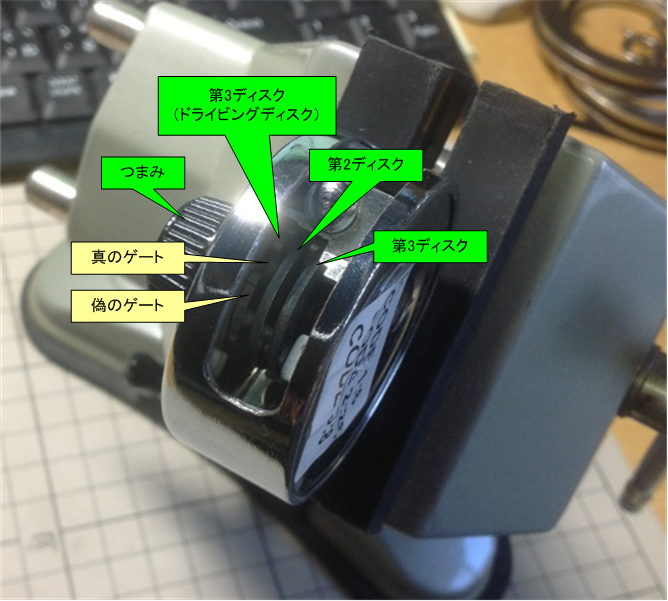
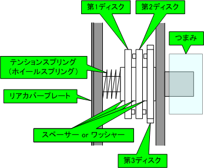

<!--
---
title: DialSafe Simulator
category: physical-security
difficulty: 2
description: Learn how a 3-wheel/4-wheel safe combination lock works via interactive visualization.
tags: [safe, dial, lock, education, physical-security]
demo: https://ipusiron.github.io/dialsafe-simulator/
---
-->

# DialSafe Simulator - 金庫ダイヤルシミュレーター

**Day050 - 生成AIで作るセキュリティツール100**

👉 **English version is available here: [README.en.md](README.en.md)**

**DialSafe Simulator**は、**ダイヤル式金庫の正規の開錠手順**と**内部構造の動き**を、ブラウザ上で学べる可視化ツールです。

ダイヤルを回すと **「ドライブカム → 各ホイール（ディスク）→ ゲート → フェンス」**の連動がアニメーションで表示され、手順どおりに操作したときのみフェンスが落ちて開錠します。

> 本ツールは教育（正規操作の理解）を目的とし、攻撃・バイパス手法は扱いません。

---

## 🌐 デモページ

👉 **[https://ipusiron.github.io/dialsafe-simulator/](https://ipusiron.github.io/dialsafe-simulator/)**

ブラウザーで直接お試しいただけます。

---

## 📸 スクリーンショット

>   
>
> *ダミー*

---

## ⚠️ 注意事項（対象とするダイヤル錠）
金庫のダイヤル錠には多様な方式があります。本ツールは、**日本で広く普及する家庭用の「4枚座の固定ダイヤル錠（固定変換ダイヤル錠）」**を簡易モデル化して可視化しています。 

実機仕様・メーカー差によって構造や操作手順は異なる場合があります。

本ツールは教育用の**簡略化モデル**です。

- 対象：**4枚座の固定ダイヤル錠（固定変換ダイヤル錠）**
- 想定：目盛「0–99」、4番号の正規解錠、国産機で一般的な「最初は右回し」手順
- 非対象：可変変換型／別規格・商用大型金庫の特殊機構／電子錠など

> 研究・教育以外の目的（不正アクセス・器物損壊等）での利用を禁止します。

---

## ✨ 主な機能
- **インタラクティブなダイヤル**（ドラッグ／ボタン／キーボード）
- **内部可視化**：ドライブカム・各ディスクのゲート位置・フェンスの上下
- **正規開錠シミュレーター**：回転方向・通過回数（カウント）を追跡
- **学習モード（LEARN）**：手順の要点・用語の解説、デモ再生
- **チャレンジモード（CHALLENGE）**：ランダム暗証での正規解錠チャレンジ
- **英日切替**：日本語／英語のUIを切り替え可能

---

## 🖼 参考図（固定ダイヤル錠の外観・構造）

### 外観とダイヤル

### 側面（ディスク構成の見え方）

### 断面概略（要素名称）

### 施解錠のイメージ（1枚ディスクでの説明）
**図1：鍵側が施錠で閂が出ている（扉は開かない）**  

**図2：鍵側のみ解錠だが、ダイヤル側ゲートが合わず閂を引き込めない**  

**図3：鍵側解錠かつダイヤル側ゲート位置が合致 → 閂を引き込み開扉**  

### 実機（横／裏）

---

## 🔩 固定ダイヤル錠の基礎（4枚座・固定変換）
以下は[『ハッカーの学校 鍵開けの教科書』](https://akademeia.info/?page_id=299) P451よりの抜粋・要約です（著者本人による引用）。

### ■ ダイヤル錠の施解錠の状態
ダイヤル錠は内部に複数の**ディスク**（円板）を持ちます。**4枚**のディスクなら、解錠には**4つの数字**を用います。まず理解のために**1枚**の円板だけを考えます。円板には**1つの切り欠き（ゲート）**があり、  
- **鍵側が施錠**のままなら閂は出たままで扉は開きません（図1）。
- **鍵側を解錠**しても、**ダイヤル側のゲートが解錠位置**でなければ閂を**完全に引き込めず**、扉は開きません（図2）。
- **鍵側が解錠**かつ**ダイヤル側のゲートが解錠位置**にあると、**閂を完全に引き込める**ため扉が開きます（図3）。

4枚ディスクでも同様で、**4つのゲートが閂側に一直線に揃い**、加えて**鍵側が解錠**されてはじめて扉が開きます。

> 施解錠のイメージ 図1～図3参照

### ■ 耐火金庫の固定ダイヤル錠の基本構造
主要部品の例：**目盛盤（つまみ）／表座（指標つき台座）／第1〜第3ディスク／ドライビングディスク（駆動座）／芯棒／テンションスプリング／裏座／ワッシャー／芯棒固定割りピン（45°起こしで抜去可能）**。  
芯棒を介して**ドライビングディスクのみ**が目盛盤と直結し、まず**ドライブ**されます。他ディスクは**バネで密着**しており、各ディスクの**ツク（突起）**同士が**当たり**ながら順に回転を伝達します（バネ不良だと空回りの原因）。  
**L寸法**（表座からドライビングディスクまでの距離）は取り付け時の重要寸法で、扉厚より大きく必要です。

> 実機写真：上の「実機（横／裏）」参照。

### ■ ダイヤル錠の正規の解錠法（4枚座・国産固定ダイヤル）
**ダイヤル合わせ**で4番号を順に入力します。ここでの「○回まわす」は、**解錠の数値が指標を○回通過**する意味です（「0」ではありません）。**回し過ぎたらやり直し**です。

1. **右**に**4回以上**まわしてから、**1番目**の数値で停止  
2. **左**に**3回**まわして、**2番目**の数値で停止  
3. **右**に**2回**まわして、**3番目**の数値で停止  
4. **左**に**1回**まわして、**4番目**の数値で停止

- ①完了で**第1ディスク**のゲートが解錠位置  
- ②完了で**第2ディスク**  
- ③完了で**第3ディスク**  
- ④完了で**ドライビングディスク**  
→ **4枚すべてのゲートが揃う**状態になります。

> 構造上、左始動でも最終的にゲートを揃えることは可能ですが、**番号列は右始動前提**で設計されています（ツク厚み分の誤差が出るため）。**国産は右始動が一般的**、欧米は左始動が多い点にも注意。

最後に**鍵を挿入して時計回りに回転**し、解錠します。鍵の解錠位置のまま引くことで扉を開けます（鍵がつまみの役割）。

---

## ⌨ 操作（ツール）
- 回転：`←` / `→`、微調整：`A` / `D`  
- 実行：`Enter`（手順確定／チャレンジ）、リセット：`R`  
- 言語切替：右上のセレクター（日本語／English）

---

## 🛠 技術スタック
- HTML / CSS / Vanilla JavaScript（依存なし・GitHub Pages向け）
- i18n（`data-i18n` 属性＋ローカルストレージで言語保持）

---

## 📄 ライセンス

MIT License - 詳細は [LICENSE](LICENSE) をご覧ください。

---

## 🛠 このツールについて

本ツールは、「生成AIで作るセキュリティツール100」プロジェクトの一環として開発されました。  
このプロジェクトでは、AIの支援を活用しながら、セキュリティに関連するさまざまなツールを  
100日間にわたり制作・公開していく取り組みを行っています。

プロジェクトの詳細や他のツールについては、以下のページをご覧ください。

🔗 [https://akademeia.info/?page_id=42163](https://akademeia.info/?page_id=42163)
